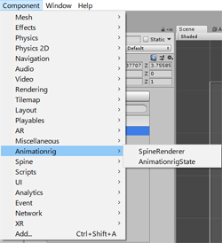
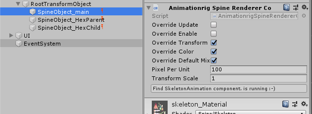
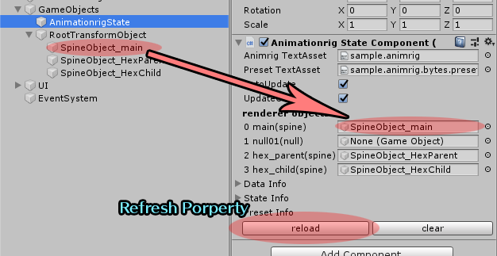

<link href="style.css" rel="stylesheet" type="text/css">

# SpineAnimationRig - Runtime

+ Basic
    + [License](#license)
    + [Spine runtime patch](#sprinepatch)
    + [Files](#files)
+ How to
    + [How to implement](#howto)
    + [How to setup physics](#howtophysics)
    + [How to implement in Unity](#howtounity)
    + [Run unity sample](#runsample)
    + [How to set values from application](#values)
    + [How to use preset file](#preset)
    + [Serialize / Deserialize (state save/load)](#serialize)
    + [Event callback](#event)
    + [UserMemo](#usermemo)
    + [How to use runtime 3.6](#howto36)
+ Class
    + [Animationrig](#animrig_animationrig)
    + [AnimationrigState](#animrig_animationrigstate)
    + [Prest](#animrig_preset)
    + [StateInput](#animrig_stateinput)
    + [StateRenderer](#animrig_staterenderer)

# Contact , Support , Product homepage

Please access the following :)<br>
以下よりアクセスしてください。

* [https://ko-ta2142.github.io/SpineAnimationrigPage/](https://ko-ta2142.github.io/SpineAnimationrigPage/)
* [https://sameasm.net/spineanimationrig/](https://sameasm.net/spineanimationrig/)


# License
<a name="license"></a>

The runtime does not use spine-runtime **alone**.<br>
ランタイムは抽象化されているため、単体ではspine-runtimeを使用しません。

If you use Spine-runtime, the Spine license also applies.<br>
Spine-runtimeを使用する場合は、Spineのライセンスも適用されます。

## Aimationrig runtime

Under the **MIT License**. 

This runtime(files) is licensed under the Expat License, sometimes known as the MIT License:
Copyright Ko-Ta Takeuchi.

Permission is hereby granted, free of charge, to any person obtaining a copy of this software and associated documentation files (the "Software"), to deal in the Software without restriction, including without limitation the rights to use, copy, modify, merge, publish, distribute, sublicense, and/or sell copies of the Software, and to permit persons to whom the Software is furnished to do so, subject to the following conditions:

The above copyright notice and this permission notice shall be included in all copies or substantial portions of the Software.

The Software is provided "as is", without warranty of any kind, express or implied, including but not limited to the warranties of merchantability, fitness for a particular purpose and noninfringement. In no event shall the authors or copyright holders be liable for any claim, damages or other liability, whether in an action of contract, tort or otherwise, arising from, out of or in connection with the Software or the use or other dealings in the Software.

## Spine runtime

* Spine License - runtime

[http://esotericsoftware.com/spine-runtimes-license](http://esotericsoftware.com/spine-runtimes-license)

# Spine runtime mix_add patch
<a name="spinepatch"></a>

Some Spine-animations may not play(draw) correctly. If the animation display is disturbed, Please use the attached patch files.<br>
Spineアニメーションによっては正しく再生されない可能性があります。もし表示が壊れる場合は、付属のパッチファイルを使用ください。

```
spine_runtime_patch/3.7/
spine_runtime_patch/3.8/
```

# Files
<a name="files"></a>

|Animtionrig||
|---|---|
|CommonMS|Multi platform binary-rw functions.|
|AnimationrigMisc|Types and basic functions. file-IO,easing,math,matrix.unicode...etc.|
|Animationrig|Read animationrig format file. Build data structure.|
|AnimationrigState|Do the animation!|
|AnimationrigPreset|Load and execute from *.animrig.preset.txt file.|
|AnimationrigPhysics|Physics model.|
|AnimationrigWiggle|Wiggler.|
|AnimationrigSpine|Use spine object.|
|AnimationrigNull|Null object.|
|AnimationrigLogger|Debug logger object. Output spine object state.|

|unity||
|---|---|
|AnimationrigIUnityStateRenderer|StateRenderer interface.|
|AnimationrigStateComponent|AnimationrigState component.|
|AnimationrigSpineRendererComponent|StateRenderer-Spine component.|

|spine mix-add patch||
|---|---|
|3.7|Spine 3.7 latest runtime patch.|
|3.8|Spine 3.8 latest runtime patch.|

# How to implement
<a name="howto"></a>

## Need a drawing environment(workspace) for spine

This runtime only has function to control spine. You need to setup an environment(workspace) to load and draw the spine.<br>
このランタイムはspineを制御するだけの機能しか有していません。spineを読み込んで表示させる環境をご用意ください。


## Load and create

First, Read the file. And create **AnimationrigState** from **Animationrig** data class.<br>
まずファイルを読み込みます。読み込んだ **Animationrig** データから実行用の **AnimationrigState** を生成します。
```csharp
    // setup data
    var anim = new Animrig.Animationrig();
    // load
    {
        MemoryStream ms = CommonMS.LoadFromFile("data/sample.animrig");
        anim.LoadFromBinary(ms);
    }
    // setup state
    var state = new Animrig.AnimationrigState(anim);
    state.OnEvent = EvenetCallback; // event callback
```

## Update

Execute by calling **AnimationrigState.Update()**.<br>
**AnimationrigState.Update()** を呼ぶことで実行します。

```csharp
    // deltatime : 1sec = 1.0
    state.Update(0.1);
```

Not enough to control spine. You need to define a class for control.<br>
これだけではspineを制御するには不十分です。コントロール用のクラスを定義する必要があります。

## Define renderer control class

Define **AnimationrigStateRenderer** class for control. The finished thing is **AnimationrigSpine.cs** file.<br>
コントロール用 **AnimationrigStateRenderer** クラスを定義します。出来上がったものが **AnimationrigSpine.cs** ファイルになります。

```csharp
// property
    public class SpineRenderer : StateRenderer
    {
        public static readonly int SaveVersion = 1; 
        public Spine.AnimationState state = null;   // Spine
        public Spine.Skeleton skeleton = null;      // Spine

        public SpineRenderer();
        // common
        public override void Update(double deltatime);
        // spine control
        public override void SetAnimation(int trackindex, int usetrack, string basename, bool loop, bool addanim, MixBlend trackmix, float duration, bool seekmode);
        public override void SetTrackBlendAlpha(int trackindex, int usetrack, float alpha1, float alpha2, float alpha3, float alpha4, bool exists);
        public override void SetTrackSeekTime(int trackindex, int usetrack, float time1, float time2, float time3, float time4, bool exists);
        public override void SetMixDuration(float duration);
        ...
    }
```

These methods are called back in AnimationrigState.Update(). Relay the instruction to Spine.AnimationState & Skeleton.<br>
これらメソッドは AnimationrigState.Update() 関数内でコールバックされます。設定された Spine.AnimationState & Skeleton へ命令を中継します。

Please see [RendererObject](#animrig_staterenderer) for details.<br>
詳しくは [RendererObject](#animrig_staterenderert) をご覧ください。

## Set renderer objects

**AnimationrigState** provides **StateInput** to control with the application. 
Set that class to the **Renderer** property.<br>
**AnimationrigState** にはアプリケーションとやり取りするための **StateInput** が用意されています。**Renderer** プロパティにセットしてください。

```csharp
    // create state renderer
    var spinerenderer = new Animrig.SpineRenderer();
    spinerenderer.state = spineobject01.AnimationState;
    spinerenderer.skeleton = spineobject01.Skeleton;
    // in sample.animrig file
    // [0] : spine object
    // [1] : null object
    state.InputObjects[0].Renderer = spinerenderer;
```

If you set a different object-type in the animation file objects, throw the exception error.<br>
もしアニメーション中のオブジェクトと異なるタイプ(object-type)を指定した場合、例外が投げられます。


# How to setup physics
<a name="howtophysics"></a>

To reflect physics, you need to define a **StateRenderer** that supports physics. This is also provided in **AnimationrigSpine.cs**.<br>
物理計算を反映させるには、物理計算に対応した **StateRenderer** を定義する必要があります。これも **AnimationrigSpine.cs** に用意されています。

```csharp
    // * support physics renderer
    var spinerenderer = new Animrig.SpinePhysicsRenderer();
    ...
    state.InputObjects[0].Renderer = spinerenderer_chara;
    // * setup physics
    state.SetupPhysics();
```

First, you need to build(setup) a physics.<br>
最初に物理計算の構築が必要になります。

## Update physics

The physics update is automatically execute with AnimationrigState.Update ().<br>
物理計算の Update は AnimationrigState.Update() で自動的に実行されます。

if you want to advance(skip) only the physics time, Call AnimationrigState.UpdatePhysics().<br>
もし物理計算だけ早く進めたいなら AnimationrigState.UpdatePhysics() を呼んでください。

``` csharp
    // skip 10sec
    state.UpdatePhysics(10.0);
```

## Appease physics

If you want to restore to the natural pose, call AnimationrigState.AppeasePhysics ().<br>
自然状態に即座に戻したい場合は、AnimationrigState.AppeasePhysics() を呼んでください。

``` csharp
    // restore natural
    state.AppeasePhysics();
```


# How to set values from application
<a name="values"></a>

Manipulating values ​​from the application is very easy :)
Access **InputObjects** to set the value. 
It has a simple easing function.<br>
アプリケーションからアニメーションへ値を送るのはとても簡単。
**InputObjects** にアクセスして値を設定します。
標準でイージング機能を持っています。

```csharp
    // inputvalue[0] = 0.5
    state.InputObject[0].SetValue(0 , 0.5f);
    // use easing
    // duration : 1.0
    // ease : InOutQuad
    state.InputObject[0].SetValue(0 , 0.5f , 1.0f , Animrig.Easing.InOutQuad);
```


# How to use preset file
<a name="preset"></a>

Adjust the value on the editor, You may want to use it on your application.
It's very easy to do with the **Preset class**.<br>
エディタで値を調整し、それをアプリケーションで使いたいと考えることもあるでしょう。
**Preset** クラスを使えば簡単に実現できます。

```csharp
    // load preset
    preset = new Animrig.Preset();
    {
        MemoryStream ms = CommonMS.LoadFromFile("data/sample.animrig.preset.txt");
        preset.LoadFromStream(ms);
    }
```

## SetPreset

Set the contents of the preset to a value. It has a simple easing function.<br>
指定した名前のプリセットを **InputObject** に反映します。
標準で簡単なイージング機能を持っています。

```csharp
    preset.SetPreset(
        state.InputObjects[0],
        "happy",       // preset name
        1.0,           // duration
        Animrig.Easing.InOutQuad   // ease
    );
```

## SetDefault

Set values to default on editor.<br>
もしエディタでデフォルト値を設定していれば、その値を設定します。初期状態では0.0になります。

## SetClear

Set values to 0.0f.<br>
値を 0.0 で設定します。

# Serialize / Deserialize (state save/load)
<a name="serialize"></a>

AnimationrigState has the state serialize function.<br>
AnimationrigStateには状態の保存機能を持っています。

```csharp
// save
var ms = new MemoryStream();
state.SaveToBinary(ms);
```
```csharp
// load
ms.position = 0;
state.LoadFromBinary(ms); // return bool
```

**Only AnimationrigState** is restored. Objects(such as spine) are not restored.
If you need a full state restore, you need to define the object SaveLoad function.<br>
復元されるのは**AnimationrigStateだけ**です。
spineなどのオブジェクトは復元されません。もし完全な状態復元が必要なら、オブジェクトのSaveLoadをあなたが用意する必要があります。

If the animation data(Animgrig file) has changed, Save data compatibility is lost. but, It will try to restore as much as possible. If fewer changes , may be possible to restore.<br>
もし、アニメーションデータ(Animgrig file)に変更が入った場合、基本的には互換性は失われます。しかし、出来るだけ頑張って復元しようと試みます。
少ない変更であれば、復元できる可能性があります。

# Event callback
<a name="event"></a>

Set the function to **AnimationrigState.OnEvent** to receive the event of the event-object on the application side.<br>
アプリケーション側でイベントオブジェクトのイベントを受け取るには**AnimationrigState.OnEvent**に関数を設定してください。

```csharp
public void OnAnimationrigEvent(Animrig.AnimationrigState state, ref Animrig.StateEventData data)
{
    // If you want to know the event source object, use InputObject.UserObject property.
    // anim.State.Inputs[0].UserObject = YoureGameObject;           // set
    // var YoureGameObject = data.Input.UserObject as GameObject;   // get
    if (data.Strings0 != "") Debug.Log(data.Strings0);
    if (data.Strings1 != "") Debug.Log(data.Strings1);
}
```
```csharp
// event
anim.State.OnEvent = OnAnimationrigEvent;
```

# UserMemo
<a name="usermemo"></a>

User-Memo is free areas from editor. If you want to keep special settings ​​in the file, please use it.<br>
エディタのユーザメモは自由に使うことが出来ます。もし特殊な値をファイルに保持させたい場合は、この領域を使うと良いでしょう。

```csharp
if (anim.UserMemo.Length > 0){
    var settingdata = anim.UserMemo[0];
}
```


# How to implement in Unity
<a name="howtounity"></a>

Components are provided for use with Unity.
You can easily setup spine. At first I think that it is good to test with Unity.<br>
Unityで使う場合は、コンポーネントが用意されています。
spineの準備も楽ちんなので、まずはUnityで触って感触を掴むと良いと思います。

## Setup spine

Please see the official page or etc.<br>
ここでは説明しません。オフィシャルページなどをご覧ください。

[http://esotericsoftware.com/spine-unity](http://esotericsoftware.com/spine-unity)


## Include Animationrig asset

Include the following files (copy to asset folder).<br>
以下のファイルを組み込んで（assetフォルダにコピーして）ください。

```
runtime/csharp/lib/*.cs
runtime/csharp/lib_unity/*.cs
```

**Animationrig** appears on **component** menus.<br>
**component** メニューに **Animationrig** が追加されます。



## Setup AnimationrigState Component

First, setup **AnimationrigState** object.
Create an empty GameObject and attach the **AnimationrigState** component.<br>
まず **AnimationrigState** を準備します。
空のGameObjectを作り、**AnimationrigState** コンポーネントを追加してください。


+ Animrig TextAsset


Set Animationrig **binary file**. To use binary files in Unity, you need to change the file-extension to **.bytes**.<br>
Animationrig**バイナリファイル**を指定します。Unityでバイナリファイルを扱うには **.bytes** に拡張子を変更する必要があります。

+ Preset TextAsset

Set the Preset text file. This file is used in text format **.txt**.<br>
Presetテキストファイルを指定します。これはテキスト形式 **.txt** で取り扱います。

+ AutoUpdate (def : true)

Automatically update time using Unity's **Update()**. If you want to control manually, please disable.<br>
Unityの **Update()** を使用して自動で時間更新を行います。手動でコントロールする場合は無効にしてください。

+ UpdateOnce (def : true)

Call object update only once.<br>
一回のUpdateでオブジェクトのUpdateを一回だけ呼び出します。60フレームで動作するなら問題ありません。

+ Renderer Objects


Set the GameObject to link with the animation. It will be explained in the next section.<br>
リンクさせるGameObjectを指定します。次のセクションで説明します。

## Setup SpineRenderer Component

Attach **Animationrig-SpineRenderer** component to the spine game object.<br>
spineのゲームオブジェクトに **Animationrig - SpineRenderer** コンポーネントを追加します。



**SpineRenderer** relays the operation of **AnimationrigState**.<br>
**SpineRenderer** は **AnimationrigState** の操作を中継する役割を持ちます。
このコンポーネントを追加しないかぎり影響を受けません。

+ Override Update (def : false)

In Unity, spine components update time. If AnimationrigState does it, please enable.<br>
Unityではspineのコンポーネントが時間更新を行います。AnimationrigStateに委ねる場合は有効にしてください。

+ Override Enable

Synchronize with GameObject.selfActive.<br>
GameObject.selfActiveと連動させます。

+ Override Transform

Synchronize with GameObject.Transform. Set the Local coordinates. Create a **RootTransformObject** like the image.<br>
GameObject.Transformと連動させます。ローカル座標が設定されるので、画像の **RootTransformObject** のようにルートを設けてください。

+ Override Color

Synchronize with the Spine.Skeleton-color.<br>
Spine.Skeletonの色と連動させます。

+ Override Default Mix

Overwrite spine-DefaultMix. If you want to set it manually, please disable it.<br>
SpineのDefaultMixの値を上書きします。手動で設定する場合は無効にしてください。

+ Pixel per Unit (def : 100)

Set the spine(GameObject) scale. There is a factor of 100 between editor and unity.<br>
spine(GameObject)の倍率を指定します。エディタとunityでは100倍の差があります。

+ Transform Scale (def : 1.0)

Set the overall scale.<br>
全体の倍率を設定します。大きさ、位置全てに影響を与えます。

## Attach Spine GameObject

Back to the **AnimationrigState** component.
Set **RendererObjects** to **GameObject**.<br>
**AnimationrigState** コンポーネントに戻ります。
**RendererObjects**にアニメーションと対応する**GameObject**を設定していきます。



If the RendererObjects name is none, please update it with the reload button.<br>
もしRendererObjectsの名前などがnoneの場合は、reloadボタンで更新してください。

# Run unity sample program
<a name="runsample"></a>

<video controls mute>
    <source src="images/unitysample.mp4" type="video/mp4">
</video>

The sample program demonstrates the following features:<br>
サンプルプログラムは以下の機能のデモンストレーションになっています。

+ Switch animation to a good feeling (fade)<br>
良い感じにアニメーションを切り替える機能（フェード）
+ Composite animation to a good feeling (track)<br>
良い感じにアニメーションを合成する機能（トラック）
+ Manage and set values ​​collectively to a good feeling (preset)<br>
良い感じに値を管理、設定する機能（プリセット）
+ Ccontrol values ​​from an application to a good feeling (direct input)<br>
良い感じにアプリケーションから値を操作する機能（ダイレクトインプット）

## Animation fade

Interpolate switching of animation to a good feeling.<br>
アニメーションを切り替える際の繋ぎを良い感じに補間します。

```csharp
    if (name == "empty")
    {
        // 1 sec fade , clear animation
        anim.State.ClearTrackFade(2, 1.0f);
    }
    else
    {
        // 1sec fade , next animation
        anim.State.EntryTrackFade(2, name, 1.0f, Animrig.Easing.InOutQuad);
    }
```

You can also check the fade feature on the editor.<br>
エディタ上でも動作確認することが出来ます。


## Animation tracks

Animationrig also has a track function. It is possible to combine multiple animations. The sample can overlap breathing motion and various movements.<br>
Animationrigでもトラックの概念があります。複数のアニメーションを合成することが可能です。サンプルでは呼吸モーション（breath body noise)に様々な動きを重ねることが出来ます。

```csharp
    anim.State.EntryTrack(0, "setup");
    anim.State.EntryTrack(1, "lol");
    anim.State.EntryTrack(2, "testmotion");
```

## Preset

Even if you control the animation from the application side, you may use values ​​designed on the editor. 
You can register a preset in the editor and use it.<br>
アニメーションをアプリケーション側からコントロールする場合であっても、エディタ上でデザインされた値を使用するケースは少なくありません。
エディタでプリセットに登録し、それを用いることが出来ます。

```csharp
    if (name == "default")
    {
        // 1 sec fade , set default
        anim.Preset.SetDefault(anim.State.Inputs[0], 1.0f);
    }
    else
    {
        // 1 sec fade , set preset
        anim.Preset.SetPreset(anim.State.Inputs[0], name, 1.0f);
    }
```

## Direct input

If you want to control the eyes from camera image processing and the mouth from microphone voice input, change the value directly.<br>
もしカメラの画像処理やマイク音声入力から、口や目をコントロールしたいなら直接値を変更しましょう。

```csharp
    anim.State.Inputs[0].SetValue(0, a1, 0.0f);
    anim.State.Inputs[0].SetValue(1, a2, 0.0f);
```

# How to use runtime 3.6
<a name="howto36"></a>

The editor does not support 3.6, but you can run 3.6 Spine by changing the program a little.<br>
エディタは3.6に対応していませんが、プログラムをちょっと変更することで、3.6のSpineを実行することが出来ます。

However, You  can not be used MixAdd function.<br>
ただし、MixAddの機能は使用できません。

## Editor side

The editor uses output in the format 3.7 or higher. These are for editor only , and not use it for programs.<br>
エディタは3.7以上の形式で出力した物を使用します。これらはエディタ専用で、プログラムでは使用しません。

## Program side

This time **Animrig.SpineRenderer** corresponds to 3.6.<br>
今回はこの **Animrig.SpineRenderer** を3.6に対応させます。

This work is easy. Change Spine-runtime version to 3.6 and compile. Then you will get errors.<br>
作業は簡単です。まずSpine-runtimeを3.6に変更し、コンパイルします。すると数カ所でエラーが出ます。

```csharp
    // mix blend
    /* comment out
    if ((track.MixBlend == Spine.MixBlend.Replace)||(track.MixBlend == Spine.MixBlend.Add))     // safe code
    {
        switch (trackmix)
        {
            case MixBlend.Add:
                track.MixBlend = Spine.MixBlend.Add;
                break;
            case MixBlend.Replace:
                track.MixBlend = Spine.MixBlend.Replace;
                break;
        }
    }
    */
```
Please comment out all of MixBlend code.<br>
MixBlendの箇所をすべてコメントアウトしてください。

# Classes

# Animationrig
<a name="animrig_animationrig"></a>
Animationrig file data class.

## Constructor()
Create Animationrig class.
```csharp
    var anim = new Animrig.Animationrig()
```

## LoadFromBinary()
Load Animationrig binary file. Read from **MemoryStream** class.<br>
Animtionrigバイナリファイルを読み込みます。MemoryStream クラスから読み込みます。
```csharp
    // file load helper
    MemoryStream ms = CommonMS.LoadFromFile("data/sample.animrig");
    if (!anim.LoadFromBinary(ms)){
        return false;   // error
    }
```

## Search()
Serch animation by name.<br>
アニメーションを名前から検索します。
```csharp
    int index = anim.Search("setup");
    if (index == -1){
        return null;    // nothing
    } esle{
        return anim.Animations[index];
    }
```

## UserMemo
User memo can be used freely string list.<br>
ユーザーが自由に書き込めるテキスト領域。
```csharp
    staring text = anim.UserMemo[0];
```

## Animations[] , AnimationCount
Animation data list.<br>
アニメーションデータのリスト。
```csharp
    Animrig.Animation a = anim.Animations[0];
```

## Objects[] , ObjectCount
Object data list. Has object settings.<br>
オブジェクトデータのリスト。オブジェクト設定が入っています。
```csharp
    Animrig.AnimObject o = anim.Objects[0];
```

## Offset , Size;
Canvas size and offset.<br>
キャンバス設定。
```csharp
    Animrig.Misc.Vector3 v = anim.Offset;
    Animrig.Misc.Vector3 s = anim.Size;
    var centerx = v.x + s.x / 2.0f;
    var centerx = v.y + s.y / 2.0f;
```

## Framerate
Timeline(Editor) base framerate.<br>
タイムラインの基礎フレームレート。

## LoadVersion , LastError
Load file state. Reflected after LoadFromBinary().<br>
ロードしたファイルの情報、またはエラーの詳細を返します。

```csharp
    if (!anim.LoadFromBinary(ms)){
        console.WriteLine("error : {anim.LastError}");
        return false;
    }
    console.WriteLine("finished : ver {anim.LoadVersion}");
    return true;
```

# AnimationrigState
<a name="animrig_animationrigstate"></a>
Run, hold state class.

## Constructor()
Create state class.<br>
実行、またはその状態を保持するクラス。
```csharp
    // data
    MemoryStream ms = CommonMS.LoadFromFile("data/sample.animrig");
    anim.LoadFromBinary(ms);
    // state
    Animrig.AnimationrigState state = new Animrig.AnimationrigState(anim);
```

## Update() , UpdatePhysics()
Advance timeline time. timeline and physics.
タイムライン時間、物理計算時間を進めます。<br>
```csharp
    state.Update(1.0 / 60);
```
物理計算時間だけ進める場合。<br>
Advance physics time only.
```csharp
    state.UpdatePhysics(10.0);  // skip 10sec
```

## SetupPhysics()
Setup all state-renderer physiscs. The physics will not start unless you call this function.<br>
物理計算を構築します。実行しない限り物理計算は反映されません。
```csharp
    state.SetupPhysiscs(anim.Objects[0].SettingField);
```
Set the string-list where the settings are written. This is stored in the object of Animtionrig data.<br>
設定が書き込まれたStringListを指定します。これはAnimtionrigデータのオブジェクトが保持しています。


## AppeasePhysics()
When exists phisics, Restore natural pose.<br>
物理計算を自然姿勢に戻します。
```csharp
    state.AppeasePhysics();
```

## EntryTrack() , ClearTrack() , ClearTracks()
Set and play animations.<br>
アニメーションを設定します。
```csharp
    state.EntryTrack(0,"setup");
    state.EntryTrack(2,"pose:test");
```
Remove animations.<br>
アニメーションを削除する場合。
```csharp
    // track
    state.ClearTrack(2);
    // all
    state.ClearTracks();
```

## EntryTrackFade() , ClearTrackFade()
Transition animation with fade.<br>
アニメーションをフェードで遷移させます。
```csharp
    state.EntryTrack(2,"facial:boo",0.5f,Easing.InOutQuad);  // duration 0.5
    // wait
    state.EntryTrack(2,"facial:lookdown",0.5);
```
Remove animations with fade.<br>
フェードで削除する場合。
```csharp
    state.ClearTrackFade(2,0.5);
```

## Tracks[] , TracksSafe[] , TrackCount , UsageTrackCount
Playing animation tracks data.<br>
再生中のアニメーショントラック情報。
```csharp
    Animrig.StateTrack t = state.Tracks[0];
```
TracksSafe() gives you access without worrying about the range.<br>
TracksSafe() を使うと範囲外かどうかを気にせずアクセスできます。変動することが多いので便利です。
```csharp
    Animrig.StateTrack t = state.TracksSafe(4096);
    if (t != null){
        // exists
    }
```
Trackcount returns the cached length. UsageTrackCount returns the length of the actual usage track.<br>
TrackCount はキャッシュが利いた値を返します。実際の使用トラック数は得るには UsageTrackCountを使用してください。
```csharp
    int n = state.UsageTrackCount;
    for (var i=0;i<n;i++){
        //
    }
```

## OnEvent
Receive EventLayer callbacks.<br>
イベントレイヤのイベントをコールバックで受け取ります。
```csharp
    void EventCallback(Animrig.AnimationrigState state, ref Animrig.StateEventData data){
        string s0 = data.Strings0;
        string s1 = data.Strings1;
        ...
    }
```
```csharp
    state.OnEvent = EventCallback;
```

## InputObjects[] ObjectCount
[StateInputs](#animrig_stateinput) object list.<br>
StateInputオブジェクトリスト。
```csharp
    Animrig.InputObject o = state.InputObject[0];
```


# StateInput
<a name="animrig_stateinput"></a>
StateInput stores the calculation result of Animationrig timeline.<br>
StateInoutは Animationrig タイムラインの計算結果を保持します。

## ObjectType
Return object type.
```csharp
    Animrig.ObjectType t = state.Input[0].ObjectType;
```

## Renderer
Set **StateRenderer** class.<br>
StateRenderer クラスを設定します。
```csharp
    state.Inputs[0].Renderer = spinerenderer;
```
Remove or default is null.<br>
初期状態、解除するには null を設定してください。
```csharp
    state.Inputs[0].Renderer = null;
```

## UserObject
You can use it freely. (c++ : void*)<br>
自由に使える object型 です。（c++ならvoid*）<br>
```csharp
    state.Inputs[0].UserObject = unityspineobject;
```

## SetValue() , GetValue() , ValueCount , SetDefaults()
Embedding values ​​in the Animationrig timeline from the application side.
Used when control directly. Usually, use [preset](#animrig.preset) function.<br>
Animtionrigタイムラインに値を組み込みます。直接操作する際に使用し、普段は [preset](#animrig.preset) を使用することになると思います。
```csharp
    state.Inputs[0].SetValue(0, 0.5f, 1.0f, Animrig.Easing.InOutQuad);  // duration 1sec
    state.Inputs[0].SetValue(1, 0.9f, 1.0f, Animrig.Easing.InOutQuad);  // duration 1sec
```
Get now value.
```csharp
    var v1 = state.Input[0].GetValue(0);
    var v2 = state.Input[0].GetValue(1);
```
Restore default values.
```csharp
    state.SetDefaults();
```

## Values , DefaultValues , DefaultRange , ValueNames
Editor settings, or more control using Values[].<br>
エディタの設定値、またはより詳細な制御をする場合は Values[] を使ってください。
```csharp
public EasingData[] Values;
public float[] DefaultValues;
public float[] DefaultRange;
public string[] ValueNames;
```

# Preset
<a name="animrig_preset"></a>
Manage PresetFile class.<br>
プリセットファイルを扱うクラスです。
## Constructor()
Create preset class.
```csharp
    var preset = new Animrig.Preset();
```

## LoadFromStream
Load preset data from MemoryStream.<br>
プリセットファイルを MemoryStream から読み込みます。
```csharp
    var preset = new Animrig.Preset();
    var ms = CommonMS.LoadFromFile("data/sample.animrig");
    if (!preset.LoadFromStream(ms)){
        return false;   // error
    }
```

## SetPreset SetDefault SetClear
Apply preset values data.<br>
プリセットを適用します。
```csharp
    Animrig.StateInput o = state.Inputs[0];
    preset.SetPreset(o , "happy" , 1.0f , Animrig.Easing.InOutQuad);    // duration 1sec
```
Restore default values. Same as StateInput.SetDefaults().<br>
デフォルト値に戻します。
```csharp
    Animrig.StateInput o = state.Inputs[0];
    preset.SetDefault(o , 1.0f , Animrig.Easing.InOutQuad);
```
Restore zero(0.0) values.<br>
0.0にセットします。
```csharp
    Animrig.StateInput o = state.Inputs[0];
    preset.SetClear(o , 1.0f , Animrig.Easing.InOutQuad);
```

# StateRenderer
<a name="animrig_staterenderer"></a>
This class reflects the calculation result of the timeline to the object. 
You can define it freely!<br>
タイムラインの計算結果を実際のオブジェクトに反映するクラスです。対象、または方法は自由に設計可能です。

For example, you can replace the Spine-object(timeline) with something other than Spine.
You can also replace physics calculations with other libraries.<br>
例えば、SpineObject(timeline) をSpine以外のものとすり替えたり出来ます。物理計算も好みの物に差し替えも可能です。

First, it is recommended to assemble with referring to the **SpineRenderer** class in AnimtionrigSpine.cs.<br>
まずは、 AnimationrigSpine.cs にある **SpineRenderer** を参考にするのが良いでしょう。

## Constructor , ObjectType
Return object type. Must be set at constructor.<br>
ObjectType は Constructor で必ず決定してください。
```csharp
        public SpineRenderer()
            : base()
        {
            ObjectType = ObjectType.Spine;
            Clear();
        }
```

## RendererEnable , RendererVisible , RendererInheritedEnable , RendererInheritedVisible
Return object state. **Inherited** is returns the inherited value.<br>
オブジェクトの状態を返します。**Inherited** は親からの継承値を返します。

```
    parent : visible = false
    child : visible = true

    parent : InheritedVisible = false
    child : InheritedVisible = false
```

## DrawPriorityZ , DrawPriorityDesign
Draw priority value.<br>
**PriorityZ** is the 3D Z coordinate.<br>
**PriorityDesign** is the priority value set in the editor.<br>
描画優先度。**PriorityZ** はZ座標。 **PriorityDesign** はエディタ上で設定された優先度値です。

In the editor, it is sorted by the following formula.<br>
エディタでは以下の式を元にソートされます。
```
    sortvalue = PriorityZ + PriorityDesign * 0x10000;
```

## TransMatrix , TransPosition , TransColor
Returns the base position and matrix of the object.<br>
オブジェクトの位置、行列を返します。
```csharp
    // get object position (same as TransPosition)
    Animrig.Vector3 v;
    v.x = 0.0;
    v.y = 0.0;
    v.z = 0.0;
    Animrig.Misc.m4Transform(ref v , ref renderer.TransMatrix);
```
Return object modulate color.<br>
乗算色を返します。
```csharp
    float a = renderer.TransColor[0];
    float r = renderer.TransColor[1];
    float g = renderer.TransColor[2];
    float b = renderer.TransColor[3];
```

## Clear()
Add initialization code.<br>
初期化コードを追加してください。
```csharp
    public override void Clear()
    {
        base.Clear();
        ...
    }
```

## Update()
Add update code. deltatime may be set to 0.0.<br>
アップデート。deltatime は 0.0 で呼ばれることがあります。
```csharp
    public override void Update(double deltatime)
    {
        // example : spine update
        state.Update((float)deltatime);
        state.Apply(skeleton);
        skeleton.UpdateWorldTransform();

        // support physics
        AddForcePhysics();
        UpdatePhysics(deltatime);
        ApplyPhysics();
    }
```

## SetAnimation()
Called when changing designed-animation and empty-animation.<br>
アニメーション、またはemptyアニメーションの切り替え時に呼ばれます。
```csharp
    public override void SetAnimation(int trackindex, int usetrack, string basename, bool loop, bool addanim, MixBlend trackmix, float duration, bool seekmode, float loopbegin, float loopend)
    {
        if (usetrack == 1)
        {
            // single animation
        }
        if (usetrack == 4){
            // blend 4track animations
        }
        if (usetrack == 2){
            // blend 2track animations (minus : invert animation)
        }
    }
```
|param||
|---|---|
|trackindex|spine track index.|
|usagetrack|layer type. 4,2,1 mode exists.|
|basename|animation name. Omit opration code.(@up,@left...)|
|loop|loop.|
|addanim|setAnimation() or addAnimation()|
|trackmix|MixBlend.Replace or MixBlend.Add|
|duration|Mix animaiton duration|
|seekmode|if use SeekLayer, true.|
|loopbegin,loopend|Loop area setting. disable is 0,0.|

## SetTrackBlendAlpha()
Set the animation blend alpha. Called every frame.<br>
アニメーションの合成値を設定します。毎フレーム呼ばれます。
```csharp
    public override void SetTrackBlendAlpha(int trackindex, int usetrack, float alpha1, float alpha2, float alpha3, float alpha4, bool exists)
    {
        if (usetrack == 1)
        {
            // single animation
        }
        if (usetrack == 4){
            // blend 4track animations
        }
        if (usetrack == 2){
            // blend 2track animations
        }
    }
```
**exists** returns whether the key data exists.

## SetTrackSeekTime()
Set the animation play time. Called every frame.<br>
アニメーションの再生時間を設定します。毎フレーム呼ばれます。
```csharp
    public override void SetTrackSeekTime(int trackindex, int usetrack, float time1, float time2, float time3, float time4, bool exists)
    {
        if (usetrack == 1)
        {
            // single animation
        }
        if (usetrack == 4){
            // blend 4track animations
        }
    }
```

## SetMixDuration()
Set the default time for animation switching.<br>
アニメーションの切り替えのデフォルト値を設定します。
```csharp
    public override void SetMixDuration(float duration)
    {
        // example : spine default mix duration
        state.Data.DefaultMix = duration;
    }
```

## SetSkin()
Set the skin by name.<br>
スキンを名前から変更します。
```csharp
    public override void SetSkin(string skinname)
    {
        //
    }
```

## SetupPhysics()
Build and create phisics.<br>
If you want to use custom physics, please create it by inheriting PhysicsGroup.<br>
物理計算を構築します。もし物理計算をカスタマイズしたい場合は、PhysicsGroup を派生して作ってください。

Called when rebuilding after loading.<br>
読み込み後、リビルド時に呼ばれます。

```csharp
    public override void SetupPhysics(List<string> setting)
    {
        Animrig.PhysicsGroup g = BuildYourCustomPhysics(setting);
        PhysicsGroups.Add(g);
    }
```

## AddPhysicsTransform()
Apply force by moving objects to physics<br>
物理計算にオブジェクト移動による力を加えます。

If you want to apply power to physics from outside Animrig, set transfrom to extrnalmatrix. 
Usually gives the identity matrix.<br>
もしAnimrigの外から物理計算に力を与えたい場合、externalmatrixに変形行列をセットしてください。通常は単位行列を与えます。

Called every frame.<BR>
毎フレーム呼ばれます。

```csharp
    public override void AddPhysicsTransform(ref Misc.Matrix4 externalmatrix)
    {
        foreach (var g in PhysicsGroups)
        {
            // custom
        }
    }
```

## AddPhysicsForce()
Apply force to physics. Called it from Physics force layer.<br>
物理計算に力を加えます。PhysicsForceLayerが使用します。

Called every frame.<BR>
毎フレーム呼ばれます。

```csharp
    public override void AddPhysicsForce(string target, double x, double y, double z)
    {
        foreach (var g in PhysicsGroups)
        {
            g.AddForce(d);
        }
    }
```
## PreparePhysics()
Collect information necessary for physics and prepare.<br>
物理計算のために必要な情報を取得したり、下準備を行います。

Called every frame.<BR>
毎フレーム呼ばれます。

```csharp
    public override void PreparePhysics(){
        foreach (var g in PhysicsGroups)
        {
            // custom
        }
    }
```

## UpdatePhysics()
Advance physics time. It moves at 100fps , It is called by dividing into 0.01 seconds.<br>
物理計算時間を進めます。100fpsで動いており、0.01秒に分割して呼ばれます。

```csharp
    public override void UpdatePhysics(double deltatime){
        foreach (var g in PhysicsGroups)
        {
            g.Update(deltatime);
        }
    }
```

## ApplyPhysics()
Reflect the result of physics to the object.<br>
物理計算の結果をオブジェクトに反映させます。

Called every frame.<BR>
毎フレーム呼ばれます。

```csharp
    public override void ApplyPhysics()
    {
        foreach (var g in PhysicsGroups)
        {
            // custom
        }
    }
```

## AppeasePhysics()
Restore to natural pose. <br>
物理計算を自然姿勢に戻します。
```csharp
    public override void AppeasePhysics()
    {
        foreach (var g in PhysicsGroups)
        {
            g.Appease();
        }
    }
```

