<link href="style.css" rel="stylesheet" type="text/css">

# SpineAnimationRig manual


SpineAnimationrig is a tool for control the **spine-runtime**.
Until now, Spine-runtime was used by programmers. Designers could not touch it.
This tool is intended to allow designers to use Spine-runtime functionality.

SpineAnimationrigは **Spine-runtime** をコントロールするツールです。
今まで Spine-runtime を使うのはプログラマーであり、デザイナーが触ることが出来ない領域でした。
このツールは、Spine-runtime の機能をデザイナーにも使えるようにすることを目的としています。

This software is **free-software**. Free to use forever.

このソフトウェアは**フリーソフトウェア**です。ずっと無料。

# Caution

This editor(SpineAnimationrig.exe) is provided for each version of Spine. 3.8 was officially released, we are developing mainly 3.8.<br>
エディタ（SpineAnimationrig.exe)はSpineのバージョンごとに用意されています。3.8が正式リリースされたので、3.8をメインに開発しています。

Please refer to [file version compatibility](#fileversion).<br>
詳しくはファイルバージョンを参照ください。

# Contact , Support , Product homepage

Please access the following :)<br>
以下よりアクセスしてください。

## homepage

* [https://ko-ta2142.github.io/SpineAnimationrigPage/](https://ko-ta2142.github.io/SpineAnimationrigPage/)
* [https://sameasm.net/spineanimationrig/](https://sameasm.net/spineanimationrig/)

## email

* <a href="mailto:k_o_t_a_2142-work@yahoo.co.jp?subject=SpineAnimationrig support">send email</a>

# Contents

* Basic
    * [Spine License](#license)
    * [Data structure](#data)
    * [File version compatibility](#fileversion)
* GUI
    * [Preview area](#previewform)
    * [Timeline area](#timelineform)
    * [Property area](#propertyform)
    * [Input value form](#inputform)
    * [AnimationTest mode](#animationtest)
* How to
    * [How to basic](#howto_basic)
    * [How to make base animation](#howto_base)
    * [How to export images](#howto_export)
    * [How to physics](#howto_physics)
* Feature & Spine misc
    * [Export images , Snapshot , movie](#exportimages)
    * [Physics](#physics)
    * [Group(Parent)](#parent)
    * [Empty animation](#empty)
    * [Skin](#skin)
    * [Custom loop time](#customloop)
* Object
    * [Common object](#commonobject)
    * [Null object](#nullobject)
    * [Spine object](#spineobject)
* Layer , key
    * [PreviousKey](#previouskey)
    * [Common layer](#commonlayer)
    * [animation blend layer](#animblend4layer)
    * [animation seek time layer](#seekblend4layer)
    * [Transform layer](#transformlayer)
    * [Event layer](#eventlayer)
    * [Priority layer](#prioritylayer)
    * [State (enable visible) layer](#statelayer)
    * [Physics force layer](#physicsforcelayer)

# License
<a name="license"></a>

## Spine

Anyone is allowed to view the exported Spine file. 
You don't need to purchase a Spine license to use this editor.<br>
エクスポートされたSpineファイルはだれでも表示させることが許されています。
このエディタの使用するためにSpineライセンスを購入する必要はありません。

But, some features require the Spine editor (pro version).
please consider purchasing.<br>
しかし、いくつかの機能はSpineエディタ(pro version)を必要とします。
購入をご検討ください。

* Spine

[http://esotericsoftware.com/](http://esotericsoftware.com/)


# Data structure
<a name="data"></a>

```
AAA animation
    * spine object
        + transform layer
        + spine layer
        + spine layer
    * null object
        + transform layer
BBB animation
    * spine object
        + transform layer
        + spine layer
        + spine layer
    * null object
        + transform layer
```

Objects and Layers structure is shared between animations.
If delete a layer, Affects all animations.<br>
アニメーション、オブジェクト、Layer、その下にKeyのデータを持ちます。
オブジェクトとLayerの構成は、アニメーション間で共有され、常に同じ構成を取ります。
もしLayerを削除すれば、全アニメーションに反映されます。

# File verion compatibility
<a name="fileversion"></a>

The version of the Animtionrig file and Spine-loader are displayed in the form caption.<br>
Animtionrigファイルのバージョン、Spineローダーのバージョンはフォームキャプションに表示されます。


|||
|---|---|
|rev|Editor build revision|
|latest|Animationrig file version|
|Spine|Spine file loader version|

## Animationrig file

The editor and runtime can read all old version files (**backward compatible**).<br>
基本的に、エディタやランタイムは古いバージョンのファイルをすべて読み込むことができます（**後方互換性**）。

## Spine file (runtime loader)

Spine-runtime-loader has not backward compatible.
Please output the file in a near version.<br>
Spine-runtimeのローダーは後方互換性を持ちません。
近いバージョンでファイル出力してください。

In principle, Editor is Used the latest runtime(loder) for each major version.<br>
原則として、エディタは大きなバージョンごとに最新のランタイムを使用しています。

## Spine runtime 3.6

Spine-runtime needs ver 3.7 or more to use MixAdd.
So the editor does not support 3.6.<br>
MixAddを使用するには3.7以上が必要です。
なので、エディタは3.6に対応しません。

The runtime source code will need to be modified,
If you omit the function, it will work in 3.6.<br>
ランタイムのソースコードに修正が必要になりますが、
いくつかの機能をオミットすれば3.6でも動きます。


# Preview area
<a name="previewform"></a>


Display a preview of the current state.<br>
現在の状態のプレビューを表示します。

## Shortcut

|keys|function|
|---|---|
|space|play.|
|shift + space|play at top.|
|mouse right|move view position.|
|mouse wheel|zoom.|

## Option

|button|function|
|---|---|
|inspect|show inspect of current object<br>現在オブジェクトの内容を表示|
|stop animation|stop animation in edit mode<br>編集中のアニメーションを停止|
|fps|preview frame rate|

## Edit handle

Edit-handle-mode can be used when selected **Transform layer**.<br>
この機能は **トランスフォームレイヤ** を選択中の場合のみ使用出来ます。

|handle|function|
|---|---|
|select|object select|
|move|edit position|
|scale|edit scale|
|rotate|edit rotate|

# Timeline area
<a name="timelineform"></a>
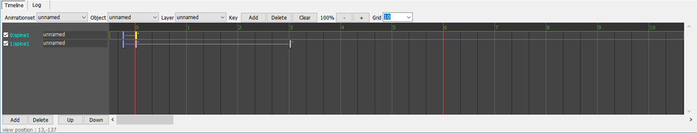

Show the animation timeline.
Edit layers and keys.<br>
選択中オブジェクトのLayer構造を表示します。

## Shortcut

|keys|function|
|---|---|
|space|play.|
|shift + space|play at top.|
|mouse left|select key.|
|shift + mouse left|grid time.|
|mouse right|move view time position.|
|mouse wheel|time zoom.|
|ctrl + mouse left|multi select.|
|ctrl + a|select all keys in layer.|
|ctrl + i|add key.|
|ctrl + r|clear key.|
|ctrl + d|delete key.|
|ctrl + shift + i|add layer.|
|ctrl + shift + r|clear layer.|
|shift + ctrl + d|delete layer.|

## Layer
<a name="layer"></a>
Can be edit layers in object.
Layer names are shared between animations.
Execute order by up to down.<br>
オブジェクトが持つLayerを編集出来ます。
名前はアニメーション間で共有されます。
実行は上から下へ順に行われます。

## Overlap key


Allow overlapping keys on Animationrig.
It is useful for jumping position.
It becomes pink color.<br>
AnimationrigではKeyの重複を許容します。
これは座標をジャンプさせる場合に役立ちます。
重複するとピンク色になります。

# Property area
<a name="propertyform"></a>

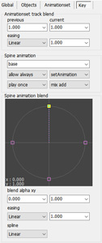

View and edit information of objects, animations, and keys.<br>
オブジェクト、アニメーション、Keyなどの情報を表示、編集します。

## Mouse edit , Edit form

<br>


Some properties can be edited with the mouse. You can also show the input form by double click.<br>
一部のプロパティはマウスによる編集が可能です。またダブルクリックで入力フォームを表示することが出来ます。

## Global

|property||
|---|---|
|Frame|Timeline framerate<br>タイムラインのフレームレート|
|Memo|User memo. Please use it freely!<br>ユーザー用メモ領域。ご自由に。|

## Object

Please referrence [ObjectType](#objecttype) page.<br>
オブジェクト項目を参照ください。

## Animation

|property||
|---|---|
|Name|animation name.|
|Preview background animation|Preview only. Animation to run behind.<br>プレビュー専用。背後に実行されるアニメーション。|
|loop ennable<br>loop disable|Loop active.|
|beginframe|Loop begin frame.|
|endframe|Loop end frame.|

## Key

Please referrence [LayerType](#layertype) page.<br>
Key項目を参照ください。

# AnimationTest mode
<a name="animationtest"></a>


This application also supports animation track blending.
You can check and preview in **AnimationTest mode**.<br>
このツールにもアニメーションを重ねる機能があります。
重ねた際の動きをプレビューしたい場合はモードを **AnimationTest** に切り替えます。

## Shortcut

|key|function|
|---|---|
|F6|switch mode.|
|space|play.|
|shift + space|play at top.|

## Auto fade

It is a function that can be used at runtime.<br>
ランタイムの機能です。

It is a function to crossfade the switching of animation to a good feeling.
It was born because the fade setting with PreviousKey is very difficult.
It is a rough control, but a very powerful(useful) feature.<br>
アニメーションの切り替えを良い感じにクロスフェードさせる機能です。PreviousKeyによるフェード設定が大変なため生まれました。大雑把ですが強力な機能です。

* disable


* enable


# Export images , Snapshot , movie
<a name="exportimages"></a>

You can output the rendered result as an image.<br>
レンダリング結果を画像出力することが出来ます。

The following settings are required to output.<br>
出力するには以下の設定が必要になります。

* **Canvas Size** is set in the Global panel.<br>グローバルパネルのキャンバスサイズが設定されていること
* The track-animation is set in the **AnimationTest-mode**.<br>アニメーションテストモードのトラックが設定されていること


## Setting

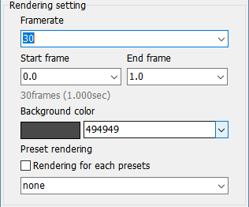

|property||
|---|---|
|Framerate|Output rendering framerate.|
|Start frame , End frame|Time area.|
|BGColor|Background color. Used only on `RGB` format.|
|Preset rendering|Output for each preset. Set a target object to apply Preset.<br>プリセットごとに動画を出力します。プリセットを適用するオブジェクトを設定してください。|


|property||
|---|---|
|Format|Output image format.<br>RGB : color<br>ARGB : color + alpha<br> A : alpha grayscale|
|Bleed,PreMultiplyAlpha|Color blend calculation. Used only on `ARGB` format.|
|Base filename|Sets the output file name format. File-exe is unnecessary.<br>出力ファイル名のフォーマットを設定します。拡張子は不要です。|
|Output directory|Set by relative or absolute output directory path.<br>出力パスを相対、または絶対パスで指定します。|

## Preset output

When Preset rendering is enabled, batch output for each preset.<br>
Preset renderingを有効にすると、プリセットごとに一括出力します。

```
filename format : images_{preset}_{frame}
```


## Movie (FFmpeg)

If FFmpeg is installed (environment path is set), movie formats(mp4 and more) can be output.<br>
FFmpegをインストール（環境パスを設定）していれば、mp4などのムービー形式を出力することが可能です。

- FFmpeg

  https://ffmpeg.org/

- FFmpeg binary

  https://ffmpeg.zeranoe.com/builds/

Select **FFmpeg: RGB** from Format.<br>
Format から **FFmpeg : RGB**を選んでください。


Set the command line to send the FFmpeg.<br>
FFmpegに送るコマンドラインの設定を行います。**Preset** からテンプレートを選ぶことが出来ます。


|property||
|---|---|
|Margin frame|Some formats (mp4) need to be sent more than the total frame.<br>一部の形式(mp4)は想定フレームより多めに送る必要があります。|
|TCP port|Send images via TCP / IP. Set the listening port.<br>TCP/IPで画像を送ります。待機ポートを指定します。|
|Preset|You can select the format template.<br>出力形式のテンプレートを選択できます。|


FFmpeg command is very difficult so please refer to the official<br>
FFmpegのコマンドは非常に難しいので説明は省略します。

## Snapshot

Outputs the current editing status as a still image.
It is useful when you want only an image easily.<br>
現在の編集状態を静止画で出力します。
簡単に画像だけ欲しい場合に便利でしょう。

You do not need to set ExportImages.
Output with ARGB(Bleed) 32 bit PNG.<br>
ExportImagesの設定は必要ありません。
ARGB32bit(Bleed)のPNGで出力します。


# Input value form
<a name="inputform"></a>

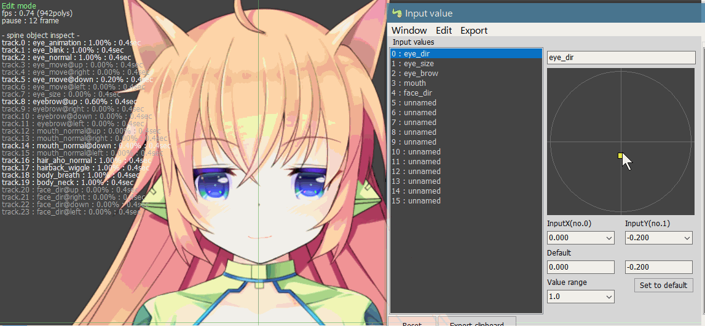

In this application, it can be use values ​​input from the external program(embedded application) into the timeline.<br>
このアプリケーションでは外部（組み込みアプリケーション）から入力された数値をタイムラインで使用することが出来ます。

## How to set input-value


If you use value from external, Set a special value to Key propertys.
Please select a value from the **right click menu**.<br>
外部からの変数を使用する場合は、Keyのプロパティに特殊な値を設定します。
右クリックメニューから変数を選んでください。

## Preset


You can store(save) the state of values.
It is saved as `*.animrig.preset.txt` in the same location as the file.<br>
値の状態を記憶しておくことが出来ます。
この情報はファイルと同じ場所に ***.animrig.preset.txt** で保存されます。

## Export to clipboard

Export the state of all values to clipboard.
You can edit the output text format with **export menu**.<br>
値の情報をクリップボードにコピーします。
出力テキストのフォーマットは **export メニュー** より設定が可能です。

|replace word||
|---|---|
|{value0}|write value by index.<br>インデックス番号の値を出力。|
|{set0.x}<br>{set0.y}|By XY index.<br>XYセット番号で指定。|
|{name.x}<br>{name.y}|By XY name.<br>XYセット名で指定。| 

* format
```
eye:{ position:[{eyepos.x},{eyepos.y}] , size:[{eyesize.x},{eyesize.y}] }
```
* output
```
eye:{ position:[0.400,0.200] , size:[0.100,0.000] }
```

# Physics
<a name="physics"></a>

<video width="auto" height="500" controls>
<source src="images/physics_sample.mp4" type="video/mp4">
</video>

Animationrig supports simple physics model (spring model).
You can easily apply physics expressions that are difficult **without Unity** to **Spine**.
Accuracy and behavior are never perfect, But I think it can be used enough to express swaying hair.<br>
簡単な物理計算（バネモデル）を搭載しています。
Unityを使わないと難しい物理計算を、簡単にSpineに適用できます。
精度も機能も決して良い物ではありませんが、髪の毛を揺らしたりする分には十分使えると思います。

## How to set physics

In the Spine editor, add `@spring` to the end of the bone name. Apply physics to this bones and children bones.<br>
Spineエディタで、bone名に `@spring` を語尾に付け加えてください。そのボーンを含む子に対して物理計算を適用します。


In this image, `boneL2` and `boneR2`, two physics groups are created.<br>
画像では `boneL2` と `boneR2` 、２つの物理計算グループが作られます。

## Alias name

If you want to use the same settings for multiple groups, set an alias name.<br>
複数のグループに同じ設定を使用したい場合は、エイリアス名を設定します。

```
bone01@spring,{alias name}
```
```
sidehair_l1@spring,hair
  sidehair_l2
    sidehair_l3
sodehair_r1@spring,hair
  sidehair_r2
    sidehair_r3
```
These two groups use a setting with the `hair` name.<br>
この２つのグループは、名前が `hair` の設定を使用するようになります。
```
hair.mode=bone
hair.k=100
```

## Physics terminator

To set the end of the group, use `@end`.<br>
グループの終端を指定する場合は `@end` を使用します。

```
boneL2@spring
  boneL3
    boneL4
      boneL5@end
        boneL Accessory01
        boneL Accessory02
        boneL Accessory03
  boneSubL3@end
    boneSubL4
      boneSubL
```
In the case, Affects the boleL3-angle and boneL4-position from boneL2.
`boneSub` branch is excluded.<br>
この場合、boneL3の角度、boneL4の位置まで影響を与えます。
枝分かれしている `boneSub` はグループから除外されます。

## Bone setting

Only default settings are supported for physics bone setting.
Cannot disable rotation from parent.<br>
また物理計算が対象となるボーンの設定は、現在デフォルト設定のみの対応となります。
親からの回転を無効化したりは出来ません。


## Animation + Physics

If the physics bone contains an animation, add the physics results to the animation.<br>
物理計算ボーンにアニメーションが含まれている場合は、アニメーションに物理計算の結果を加算します。


Since physics calculations and animations do not interact, you will not get natural motion.
However, it is useful for parts where you want to add a little physical movement.
For example, ears.<br>
物理計算とアニメーションが影響し合うわけではないので、自然な結果は得られません。
が、物理計算をちょっと足したいパーツなどには効果的です。耳とかね。

## Spring setting

Physical settings are edited on the Animationrig editor.
Edit with **setting field**.<br>
物理計算の設定はAnimationrigエディタ上で行います。
オブジェクトの **setting field** で編集します。

At first there is nothing(use default setting).
Please push the **Refresh setting text** button.
The settings are written to text area.<br>
最初はなにも無い状態（デフォルト設定が適用）なので **Refresh setting text** ボタンを押してください。
設定が書き込まれます。


```
{physics group name / alias name}.{property name}=value

boneL2.k=100
```

Property is below.
Use lowercase , Space is not allowed.<br>
指定できるプロパティは以下の通りです。
小文字で表記、スペースなどは入れないでください。


Double click (or right click menu) on the setting text to open the configuration form.
Use it if you need advanced settings.<br>
テキストの個所をダブルクリック（または右クリックメニュー）すると設定フォームが開きます。
複雑な設定が必要な場合は使ってください。

The physics calculation frame rate is fixed at 100 fps (dt=0.01).<br>
物理計算フレームレートは100fps(dt=0.01)固定です。

|property||
|---|---|
|**basic**||
|enable (def:true)|Used for disabling.<br>主に無効化する際に使用します。<br>example : aaa.enable=false
|mode (def:bone)|Spring mode. Choose from **bone,strbone,point,strpoint**. reference below.<br>バネのモードを設定します。詳しくは以下参照。|
|k (def:100)|Spring constant. Larger , more amplitude(swing).<br>バネ定数。値が大きいほど振幅します。|
|damping (def:10)|Velocity damping value.<br>速度減衰値。|
|mass (def:1.0)|Mass, weight. Larger , move slowly.<br>質量、重さ。大きいほどゆっくり動きます。|
|**control**||
|alpha (def:1.0)|Physics blend ratio. Allow negative values.<br>物理計算の合成率。マイナスを許容します。|
|force (def:1.0)|Sets the strength of the force. Zero : disable. Negative : invert.<br>加わる力の強さを設定します。０で無効、マイナスで反転。|
|**gravity**||
|gravity (def:0.0)|Unsupported. Gravity power. I think ,not used it often.<br>現在未対応。重力。バネではあまり使わないと思います。|
|gravityvector (def:0,-1,0)|Unsupported. Gravity direction.<br>現在未対応。重力方向。<br>example : aaa.gravityvector=0,-1,0|
|**limitter**||
|limitvelocity (def:1000)|Limit the velocity.<br>速度制限値。|
|limitangle (def:-1.0,+1.0)|Limit the angle. Set the relative value from the natural angle.<br>角度(360=1.0)を制限します。自然角度からの相対値で指定します。<br>example : aaa.limitangle=-0.12,0.12|
|limitmove (def:65535.0)|Limit the moving range. Set the distance from the natural position. The value set the ratio of spring length.<br>移動範囲を制限します。自然位置からの距離で設定、値はバネの長さの比率を使います。<br>example : aaa.limitmove=0.5|
|| |


## Spring mode


There are four types of springs : **bone,strbone,point,strpoint**.
Each mode has the characteristics of returning to original shape.<br>
バネには **bone,strbone,point,strpoint** の４種類があります。
ケースにより使い分けましょう。
どれも元の形状に戻ろうとする性質を持ちます。

* bone

The length is a fixed. Affects bone angle(rotate).
The most basic and most versatile spring.<br>
長さが固定のバネで、ボーンの角度に影響を与えます。
最も基本的で何にでも使えるスプリングです。

* strbone

This mode can stretch in bone length. 
Can be used for hair and cloth.<br>
伸び縮みする **bone** です。
髪の毛や布に使えます。


* point

The length is a fixed. Affects bone position only.<br>
長さが固定のバネで、ボーンの位置のみ影響を与えます。

* strpoint

Swiiiiing spring. Affects bone position only.
Used for breast and body sagging.<br>
基本的な伸び縮みするビヨンビヨンするバネです。
ボーンの位置に影響を与えます。胸や体のたるみに最適です。

## Attention of bone angle

The spring is a model that controls the position. 
So, there is a limit to the bone structure in the `bone,strbone` mode that controls the angle.<br>
バネは位置をコントロールするモデルです。
そのため角度を制御する `bone,strbone` モードではボーン構造に制限があります。

Basically, `bone,strbone` should be constructed with **straight structure** where the bones **do not branch**.<br>
基本的に `bone,strbone` ではボーンが枝分かれしない **直線構造** で組んでください。

If the bone branches off, The bone positions must be the same.<br>
もしボーンが枝分かれする場合、ボーンの位置を同じにする必要があります。


If the position is different, Does not display correctly.<br>
もし位置が離れている場合は、正しく表示されません。

## How to give better force

When rotating, it seems that force does not apply well. In that case, it is recommended to disable rotation from the parent.<br>
位置の移動に対しては良い動きをしますが、回転に関してはうまく力が伝播しにくいようです。その場合、親からの回転を切るのがお勧めです。

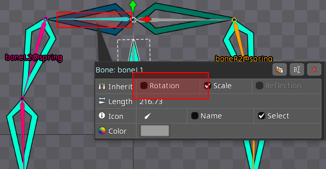

It cannot be set for physics bones.
It ’s a good idea to add a bone in front.<br>
物理計算ボーンには設定できないので、手前にボーンを追加してやるといいでしょう。

This technique is very useful for hair.<br>
髪の毛などでとても使えるテクニックです。


# Empty animation
<a name="empty"></a>

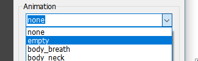

Spine's **empty-animation**(SetEmptyAnimation) is a function that restores the default pose (setup).
However, be careful when using it because it behaves a bit specially.<br>
はSpineの **empty-animation**(SetEmptyAnimation) はデフォルトポーズ(setup)に戻す機能です。
が、少し特殊な動きをするので、使用には注意を払ってください。

## Remove animation

There is no problem when erasing the animation.
Fade to default pose at trasition time.<br>
アニメーションを消す場合は問題ありません。
遷移時間でデフォルトポーズにフェードします。

**track** is then initialized to `null`.<br>
その後、**track** は `null` に初期化されます。

## Entry animation on null track

Spine will not fade animation if **track** is `null`.
This behavior may cause the animation to be skipped.<br>
Spineは **track** が `null` の場合、アニメーションがフェードしません。
この挙動はしばしばアニメーションが飛ぶような挙動を生み出します。

## Best practice


Best practice is not to use `empty`.
Make an animation with Spine that does nothing (no key) in advance.
Use this animation instead of `empty`.<br>
最善策は、`empty` を使用しないことです。
あらかじめ何もしない（keyが１つも存在しない）アニメーションをSpineで作っておきましょう。
このアニメーションを `empty` の代わりに使用しましょう。

# Skin
<a name="skin"></a>

The default treatment for skins depends on the spine-runtime version. In 3.7, restor the setup state skin.
But, In 3.8, selected nothing (not visible).<br>
スキンはデフォルトの扱いがspine-runtimeのバージョンによって異なります。
3.7ではsetupの状態を復元しますが、3.8では何も選択されていない状態を復元します（表示されない）。


There is DefaultSkin in the setting of the Spine object.
Select a skin to display in the default state.<br>
Spineオブジェクトの設定に DefaultSkin があります。
デフォルト状態で表示するスキンを選択してください。

# Custom loop time
<a name="customloop"></a>

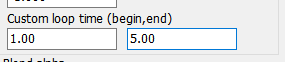

In the Spine editor, the loop starts at 0 frame, but can be changed it at runtime.
Set the start time and end time when animation changing.
The end time can be set beyond the original time.<br>
Spineエディタではループは0スタートですが、ランタイムでは変更可能です。
アニメーション切り替え時に開始時間と終了時間を設定します。
終了時間は本来の時間を超えて設定できます。

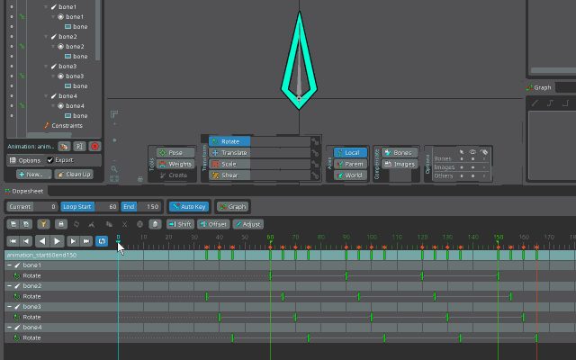

With this feature, Cut out the overflowed key, Then adjust to the loop area...
This work becomes unnecessary. Yeah---!<br>
これにより、はみ出たKeyをぶつ切りにして、ループ範囲に合わせて整える、という作業をする必要がなくなります。いえーーー。

```
loopbegin : 2.0 (60frame)
loopend : 5.0 (150frame)
play loop
```


Like this.<br>
こんな風に。

# Group(Parent)
<a name="parent"></a>


You can inherit the transformation(move,rotate,scale) of the parent.<br>
親の変形を継承する事が出来ます。


Set the parent object with **Group(Parent)** in the Object panel.
For Spine objects, you can set bones.
In that case, the bone transformation is also inherited.<br>
オブジェクトパネルの **Group(Parent)** で親オブジェクトを設定してください
Spineオブジェクトの場合は、ボーンを設定することも出来ます。
その場合は、ボーンの変形も継承します。


# Object type
<a name="objecttype"></a>

# Common Object
<a name="commonobject"></a>
Shared property of all Objects.<br>
全Objectタイプで使用される共通プロパティです。

|property||
|---|---|
|**common**||
|name|Object name. Allow duplicate names.|
|enable|Update & show object.|
|visible|Show object.|
|offset|Offset position.|
|scale|Base scale.|
|Group (parent object)|Inherit(link) the position, scale and etc from parent object.<br>親objectの位置などを継承します。|
|Draw Priority|Design draw priority order.|
|**setting**||
|setting|Setting text field. Used mainly for physics setting.<br>設定用テキスト。主に物理計算設定などに使用されます。|


# Null Object
<a name="nullobject"></a>

Null object.
Not displayed by default.<br>
空オブジェクト。
デフォルト状態では表示されません。
ユーザが拡張して意味を持つオブジェクトです。

You can display the temporary image.<br>
仮画像を表示することが出来ます。

# Spine Object
<a name="spineobject"></a>

This object controls the **spine** file.<br>
**spine**をコントロールするためのオブジェクトです。

Spine file-path is recorded with relative path.
Please be careful not to include personal information such as desktop pass.<br>
spineファイルは相対パスで記録されます。
**パスに個人情報が入らないようにご注意ください。**

### preview support function

Editor support status.<br>
エディタ上での表示対応状況です。

|function||
|---|---|
|blend|yes|
|tintcolor|no (diffuse * modulatecolor + tintcolor)|
|clipping|yes|

### property

|property||
|---|---|
|filename|spine exported file.Please use `json` format that is as compatible as possible<br>spineのexportファイルを指定します。出来るだけ互換性の高い `json` 形式を使用しましょう。|
|mix duration|default mix duration time.|
|PreMultiplyAlpha|Change the blending method to PreMultiplyAlpha.<br>ブレンドをPreMultiplyAlpha方式に切り替えます。|
|Default skin (def:default)|Set starting skin name. <br>開始時のスキン名を指定します。|

# Layer type , key property
<a name="layertype"></a>

# PreviousKey
<a name="previouskey"></a>

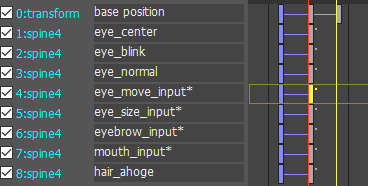

Layer has normal-key and **PreviousKey**.
PreviousKey Holds the previous (changed)animation values. 
This key is used to control transition of animation switching.<br>
Layerには通常Keyと **PreviousKey** が存在します。
PreviousKeyは変更前のアニメーションの状態を保持します。
このKeyはアニメーション切り替えの遷移を制御する時に使用します。

PreviousKey is displayed in blue color。You can not edit the value or time. 
Only easing can be set.<br>
PreviousKey は青色で表示されます。値や時間は編集できません。イージングのみ設定することが出来ます。

However, there are **[AutoFade](#animationtest)** for animation switching control.
It is a function to automatically crossfade to feel good.
leave it to you.<br>
しかし、アニメーションの切り替え制御には **[AutoFade](#animationtest)** があります。
良い感じに自動でクロスフェードする機能です。
どちらを使うかはお任せします。

# Common layer
<a name="commonlayer"></a>

Shared property of all layers.<br>
全Layerタイプで使用される共通プロパティです。

## track blend

Set the blend-weight when mixing animation.
The blend calculation is below.<br>
アニメーションを重ねた場合の値の比重を設定します。
計算は以下になります。

```
track0 ... previous track
track1 ... current track

out = (track0.AlphaX * previous) + (track1.AlphaX * current)
```

* Add (default)

Default is 1.0. Add blend.<br>
デフォルトは 1.0 で加算です。

```
previous : 1.0
current : 1.0

out = track0.AlphaX * 1.0 + track1.AlphaX * 1.0
    = track0.AlphaX + track1.AlphaX
```

* replace

In the case of replace.<br>
上書きする場合。

```
previous : 0.0
current : 1.0

out = track0.AlphaX * 0.0 + track1.AlphaX * 1.0
    = track1.AlphaX
```

# Transform layer
<a name="transformlayer"></a>


## move , scale , rotate

Control move, scale, and rotate.<br>
移動、伸縮、回転を制御します。

## easing

Select the value transaction.<br>
値の遷移を選択します。

## spline

Performs curve interpolation using the values ​​of the 4 keys.<br>
前後4Keyの値を使って曲線補間を行います。

## rotate order

Select X,Y,Z rotation order.
`pass` will use the previous settings when mixing animations.<br>
回転の順序を指定します。
複数のアニメーションを重ね合わせた場合、`pass` は前の値を引き継ぎ、使用します。

## Multi transform-layer composite

If you set multi-layers, values ​​will be composite from top to bottom.<br>
もし複数のLayerを設置した場合、値は上から下へ合成（行列合成）されていきます。

# Animation blend layer
<a name="animblend4layer"></a>


Composite animations with using 4(or 1,2) tracks on spine.<br>
**spine** の4(または1,2)トラックを使用して、アニメーションを合成します。

If 2 tracks, animation is inverted when BlendAlpha is negative value.<br>
2トラックの場合はBlendAlphaがマイナス値でアニメーションが反転します。

## Animation name format (spine side)

Spine-animations are assigned in 4 directions (up, down, left, right) by name.<br>
Spineアニメーションは名前規則にそって4方向（上下左右）に割り当てられます。

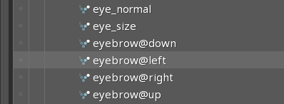

|name format||
|---|---|
|name<br>name@up|up (+Y)|
|name@right|right (+X)|
|name@down|down (-Y)|
|name@left|left (-X)|

If not exists animation, `empty` will be set.<br>
空アニメーションには `empty` が設定されます。

## name

Set Spine-animation name.<br>
Spineアニメーション名指定します。@以降は不要です。

|name||
|---|---|
|none| pass set animtion.<br>パスします。<br>
|empty| set empty animation.<br>emptyアニメーションを設定します。

## allow

Execution allow from animation name.<br>
アニメーション名を比較、実行を許可、禁止します。

|property||
|---|---|
|allow diffrent|Only if dirrent name.<br>名前が異なる場合のみ|
|allow always|Always execute.<br>常に許可。|

## setAnimation , addAnimation

|property||
|---|---|
|setAnimation|Change now!<br>今すぐアニメーションを変更する。|
|addAnimation|Change at end point.<br>終端でアニメーションを切り替える。|

## play

|property||
|---|---|
|play one|One shot.|
|play loop|Loop.|

## mix blend

Sets the animation blending method between tracks.<br>
spineのトラック間の合成方法を設定します。

|property||
|---|---|
|mixReplace|Replace mode.<br>置き換えモード。|
|mixAdd|Add mode. Combine multi animations.<br>加算モード。複数のアニメーションを合成します。|

## mix duration time

Over write the animation mix blend duration-time.<br>
アニメーション繊維時間を上書きします。

|property||
|---|---|
|-1.0|Use default mix duration.<br>spineに設定に委ねます。|
|0.0|disable mix animation.<br>アニメーションミックスを行いません。|

## Custom loop time

Can change animation loop area.
Please refer to <a href="#customloop">CustomLoop</a>.<br>
アニメーションのループ範囲を変更できます。
詳しくは<a href="#customloop">CustomLoop</a>をご覧ください。

# Animation seek time layer
<a name="seekblend4layer"></a>


Composite **time-stretched** animations with using 4(or 1) tracks on spine.<br>
再生時間をコントロール（タイムストレッチ）されたアニメーションを合成します。


When used 4 animation, Composed with alpha 1.0.
The 0 frame should be in the same pose.<br>
アニメーションを４つ使用する場合は、alpha1.0で合成されます。
0フレームは同じポーズである必要があります。

## animation properties

Please refer to [animations blend layer](#animblend4layer).<br>
[animations blend layer](#animblend4layer)を参照ください。

## seek time

Set playback-time. 
if enabled **loop** in animation properties, Will loop-play over terminate(animation end) time.<br>
合成値の代わりに再生時間を設定します。
アニメーションに **loop** が設定されている場合は、終端時間以上でループするようになります。

# Event layer
<a name="eventlayer"></a>

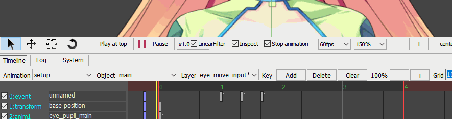

Execute the event on the application side.<br>
組み込みアプリケーションに対してイベント（コールバック）を実行します。

## ID

event name. In the case of **none**, it passes.<br>
イベント名。自由な名前を設定出来ます。
**none**の場合は無視されます。

## allow

Execution allow from event-ID.<br>
IDを比較、実行を許可、禁止します。

|property||
|---|---|
|allow diffrent|Only if dirrent name.<br>名前が異なる場合のみ|
|allow always|Always execute.<br>常に許可。|

## strings , floats

Send value to application side.
Line return code `crlf(0x0D,0x0A)` is used.<br>
アプリケーションに値を渡します。
改行は `crlf(0x0D,0x0A)` を使用します。

# Draw priority layer
<a name="prioritylayer"></a>

|property||
|---|---|
|priority|Display(draw) order. Relative.|

Set the display order. The higher the value, it will be displayed on the front.<br>
表示順序を操作します。値が大きいほど手前に表示されます。

# State (enable visible) layer
<a name="statelayer"></a>

Toggles enable / visible of the object.<br>
オブジェクトの enable,visible を切り替えます。

|property||
|---|---|
|enable|Object enable.|
|visible|Object visible.|

If enable is false, object update will not be called. But The timeline advances.<br>
enableをfalseにすると、objectのupdateを呼ばなくなります。が、タイムラインは進みます。

# Physics force layer
<a name="@hysicsforcelayer"></a>


Give power to physics.<br>
物理計算に力を加えます。

## Target physics group

Set the target physical calculation group.<br>
対象となる物理計算グループを指定します。

`all` can target everything.<br>
`all` で全てを対象にすることができます。

## Direction vector

Set the direction and strength of the force.<br>
力の向き、強さを指定します。

## Wiggle

Give wiggle to force.<br>
力にゆらぎを与えます。

|property||
|---|---|
|ratio|Ratio of wiggle to give to DirectionVector.<br>DirectionVectorに与えるwiggleの比率。|
|cycle|Rundom cycle. per 1sec.<br>1秒間の乱数サイクル。|


# How to basic
<a name="howto_basic"></a>

Let's actually make sample.
Create a SpineBoy action.<br>
それでは実際に作ってみましょう。
Spineに付属するサンプル、SpineBoyを使ってアクションさせてみましょう。

The data is in `editor/sample_data/boy/`.<br>
データは `editor/sample_data/boy/` にあります。

Spine data license below.<br>
spineファイルの使用ライセンスを一応載せておきますね。

```
Copyright (c) 2018, Esoteric Software

The images in this project may be redistributed as long as they are accompanied
by this license file. The images may not be used for commercial use of any
kind.

The project file is released into the public domain. It may be used as the basis
for derivative work.
```

## Export json and atlas file

To load Spine file with this tool, you must first output in **json, atlas** format.
Start Spine application and load `boy.spine`.
Select **export (ctrl + E)** from the menu.<br>
このツールでSpineを読み込むには、まず **json,atlas** 形式で出力する必要があります。
Spineを起動して `boy.spine` を読み込みましょう。メニューから **export (ctrl + E)** を選択します。

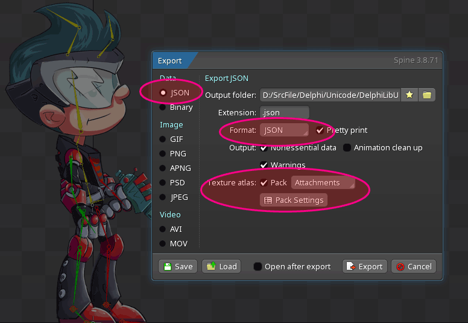

Can be load Binary format, but `json` is recommended for compatibility.
Enable `TextureAtlas` and configure `Pack Settings`.<br>
Binaryも読み込めますが互換性等で `json` をお勧めします。
`TextureAtlas` も有効にして、`Pack Settings` の設定も行いましょう。

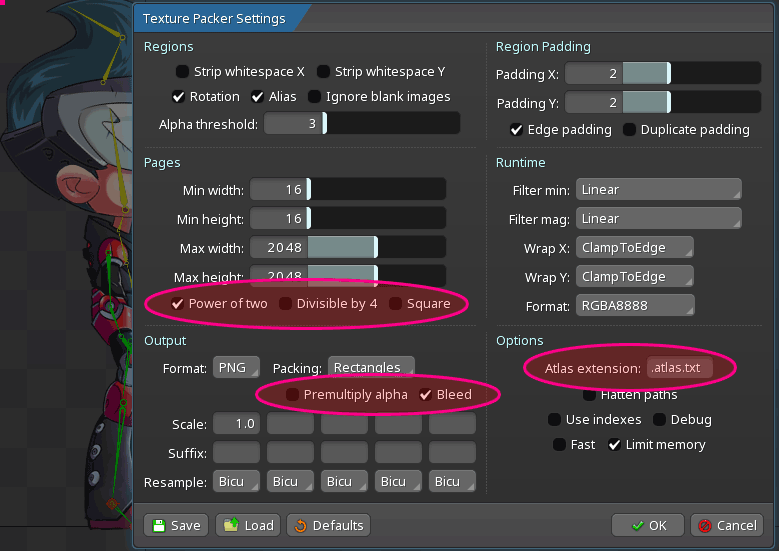

There are about two important points.
Texture size setting choose `Power of two`.
The texture format is recommended to be `bleed`.<br>
重要な箇所は２つぐらいです。
テクスチャサイズはUnityなどを考慮して `Power of tow` を選んでください。
テクスチャ形式は `bleed` をお勧めします。

Create a working directory and output it there.<br>
作業ディレクトリを作って、そこに出力してください。
```
spineboy-pro.atlas.txt
spineboy-pro.json
spineboy-pro.png
```

## Run Animationrig and save as file

Start Animationrig. If the Spine version is 3.8, Please start **Animationrig38.exe**.<br>
Animationrigを起動します。Spineのバージョンが3.8系なら、**Animationrig38.exe** を起動してください。

First, save file in the working directory.
Since relative path is used for data, Copy the use files into working directory as much as possible.<br>
まず最初に、先ほど作った作業ディレクトに保存してください。データは相対パスが使われるので、使用するファイルはできる限り作業ディレクトリ内にコピーして使いましょう。

Two more animrig files have been added.<br>
animrigファイルが2つ増えました。
```
spineboy-pro.atlas.txt
spineboy-pro.json
spineboy-pro.png
boy.animrig
boy.animrig.preset.txt
```

## Load spine

Load the Spine file.
Use **SpineObject** to display it.
One SpineObject is prepared in the initial state of the project.<br>
Spineファイルを読み込みます。
表示するには **SpineObject** を使用します。
起動時、プロジェクトの初期状態では、SpineObjectが１つ用意されています。

In the right side panel, select **Object**.<br>
右のサイドパネルで、**Object** を選択します。

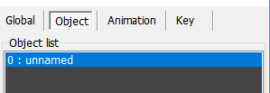

Select the Spine file (spineboy-pro.json) from **browse** button.<br>
**browse** ボタンからSpineファイル(spineboy-pro.json)を選んでください。

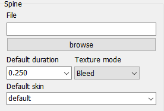

Is it displayed?<br>
表示されましたか？


If you modified the Spine file, select **rebuild** from the object menu.
It will be reloaded.<br>
もしSpineファイルを修正した場合は、オブジェクトメニューから **rebuild** を選択してください。再読込されます。

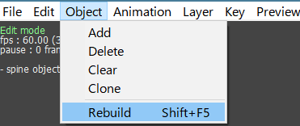

## Play animation

Let's play the animation.
Select the second `layer (anim1 unnamed)` from the timeline.
There is a blue key and a white key. The blue key will be explained later.
Please choose a white key.<br>
アニメーションを再生させてみましょう。
タイムラインから２番目の `layer (1:anim1 unnamed)` を選びます。
青いkeyと白いkeyがあります。青いkeyは後ほど説明します。
白いkeyを選んでください。


Next, do the animation settings.
the key properties are displayed in the side panel.
set the **animation name** and **loop playback**.<br>
次に、アニメーションの設定を行います。
サイドパネルにkeyのプロパティが表示されているので、アニメーション名、ループ再生を設定します。


```
animation name : run
allow always
play loop
```
set this.
`allow always` always switches the animation.
If you want to skip the same animation, set `allow diffrent`.<br>
と設定しましょう。
`allow always` は常にアニメーションを切り替えます。
もし同じアニメーションの場合スキップするには `allow diffrent` を設定します。

Next, set the animation blend ratio.
If there is a single animation, only the top direction is used.
The middle(center) is a blend rate of 0%.<br>
次にアニメーションのブレンド率を設定します。
アニメーションが１つの場合は、上方向のみ使用します。
真ん中がブレンド率0%です。


Let's play animation (shif + Space).<br>
では、再生 (shif + Space) してみましょう。


how is it? Did he run?<br>
どうですか？彼は走りましたか？


## Move object

Let's move the position according to the animation.<br>
アニメーションに合わせて位置を移動させましょう。

The first `layer (0: transform unnamed)` moves, transforms and rotates.
Click at 1 second on the timeline, to add a key (ctrl + I).<br>
１番目の `layer (0:transform unnamed)` が移動、変形、回転を行います。
タイムラインの１秒当たりをクリックして、keyの追加 (ctrl + I) を行います。


Set `X coordinate: 500` in the Key property.
**easing** can add weight to the movement.<br>
Keyのプロパティで `X座標:500` に設定しましょう。
**easing** で動きに重みをつけることができますよ。


Let's **play (ctrl + Space)**. Did he go forward?<br>
再生 (ctrl + Space) してみましょう。彼は前に進みましたか？

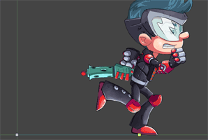

## Animation change

Let's transition the animation.<br>
アニメーションを遷移させてみましょう。

Select Second `layer (1:anim1 unnamed)`.
Click at 1 second on the timeline, to add a key (ctrl + I).<br>
2番目の `layer (1:anim1 unnamed)` を選択。
1秒あたりをクリックして、keyの追加(ctrl+I)を行います。


Set the Key properties as follows. Loop is unnecessary because it is a jump.<br>
Keyのプロパティは以下のように設定します。ジャンプなのでループは不要ですね。

```
animation name : jump
allow always
play once
```

Did he jump?<br>
彼はジャンプしましたか？


## Multi track animation blending

The main feature of Spine! A **multi-animation composition** function.<br>
Spineの目玉商品！ 複数アニメーションの合成 機能です。

Add the set up a gun animation to this.<br>
このアニメーションに銃を構えるアニメーションを足します。

First, add a layer to play the animation (ctrl + Shift + I).<br>
まずは、アニメーションを再生するレイヤを追加 (ctrl + Shift + I) します。


Choose `1 Animation blend layer`.<br>
`1 Animation blend layer` を選んでください。

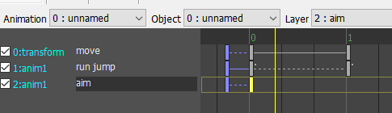

Will be added as follows.
Adjust the position with the up / down buttons below.
Let's name it as the number of layers has increased.<br>
以下のように追加されます。
位置は下のup/downボタンで調整してください。
layerも増えてきたので名前を付けておきましょう。

Set the key property.<br>
keyのプロパティを設定します。

```
animation name : aim
allow always
play once
```

Animation is no change. 
I forgot to set the blend rate. Let's set it 100%.<br>
変化がありませんね。ブレンド率の設定を忘れていました。
100%にしましょう。


Did he aim the gun at the sight?<br>
彼は銃を照準に合わせましたか？


## Directionality animation blending

Next, let's move the aim.<br>
次に、照準を動かしてみましょう。

Cannot move the aiming bone directly.
The aim is up, the aim is down, Combine the two animations to move the aim.<br>
直接照準ボーンを動かすことは出来ません。
照準が上、照準が下、２つのアニメーションを合成して移動させます。

Add a layer (ctrl + Shift + I).<br>
レイヤを追加 (ctrl + Shift + I) します。

This time, you need 4 direction animation blend, so select `4 Animations blend layer`.<br>
今回は４方向のアニメーションブレンドが必要なので `4 Animations blend layer` を選択します。


Set the key property.<br>
keyのプロパティを設定します。

```
animation name : target
allow always
play loop
```

Play once (Shift + Space) to reflect the animation.
Please try to blend ratio.<br>
一度再生(Shift+Space)させてアニメーションを反映させます。
ブレンド率を弄ってみてください。

Did his aim move up and down?<br>
照準が上下に動きましたか？


Two animations were set up and down even though only one animation name was set.
Why did this happen?<br>
アニメーション名を1つしか設定してないのに上下２つのアニメーションが設定されました。
どういうことでしょうか？

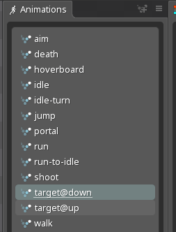

Looking at the animation list in Spine, **@down, @up** behind the name.
You can see that it is determined by a special name.<br>
Spineでアニメーション一覧を見ると、 **@down, @up** が名前の後ろについています。
特殊な名前で決められています。

The above is the basic. Congratulations!<br>
以上が基本です。お疲れ様。


# How to make base animations
<a name="howto_base"></a>

This is how to build a basic animation in SpineAnimationrig.<br>
SpineAnimationrigにおけるアニメーションのお作法です。

SpineAnimation rig can also combine animation.
So when creating multiple animations,
Created separately **base-pose** and **extended-pose**,
Combine at runtime.
By doing this, you can create data that have the resistance to change.<br>
SpineAnimationrigでもアニメーションを合成することが可能です。
なので、複数のアニメーションを作るときは、**基本ポーズ、拡張ポーズ**と分けて作成、実行時に合わせます。
こうすることで、変更に強いデータを作ることが出来ます。

```
base

walk
run
jump
```

## Setup spine

As a sample, Use Spine's official sample "owl".
The data is in `editor/sample_data/owl/`.<br>
サンプルとして、Spine公式のown（フクロウ）さんを使います。
データは `editor/sample_data/owl/` にあります。

Create a working directory and export it.<br>
作業ディレクトリを用意して、SpineでExportしてください。


Start SpineAnimationrig, First save to working directory, Next load owl with SpineObject.<br>
SpineAnimationrigを起動して、まず作業ディレクトリに保存、SpineObjectでowlを読み込みましょう。

```
sample.animrig
sample.animrig.preset.txt
owl-pro.atlas.txt
owl-pro.json
owl-pro.png
```

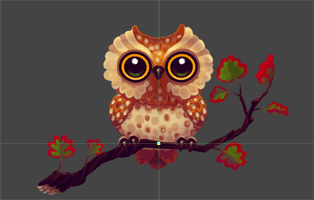

so cute!<br>
あらかわいい。

## Make base pose animation

The animation of an owl is shown below.<br>
owl（フクロウ）のアニメーションはこのようになっています。


It consists of three animations: blink, idle and dir (face direction).<br>
blink（瞬き）、idle（呼吸）、dir（顔の向き）の３つで構成されます。

Let's combine three animations by adding layers.<br>
レイヤを追加して３つのアニメーションを合成しましょう。

```
layer[0] : 1 animation blend layer
key[0]
  animation name : idle
  allow always
  setAnimation
  play loop
  mix replace

  alphaX : 0%
  alphaY : 100%
```
```
layer[1] : 1 animation blend layer
key[0]
  animation name : blink
  allow always
  setAnimation
  play loop
  mix replace

  alphaX : 0%
  alphaY : 100%
```
```
layer[2] : 4 animations blend layer
key[0]
  animation name : dir
  allow always
  setAnimation
  play loop
  mix add

  alphaX : 0%
  alphaY : 0%
```


The **base-pose** is complete. Let's play and check.<br>
基本ポーズの完成です。再生して確認しましょう。


## Make extend pose animation

Next, create an **extended-pose** based on the **base-pose**.<br>
次に基本ポーズを元にした、拡張ポーズを作ります。

Add and name an animation.<br>
アニメーションを追加、名前を付けましょう。

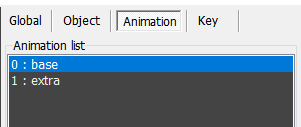

Select the added animation and set **Preview background animation**.
Play the set animation in the background.
Set `base`.<br>
追加したアニメーションを選択して、**Preview background animation** を設定します。
これは、設定されたアニメーションを背後で再生します。
`base` を設定します。

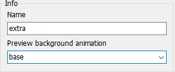

This will combine the two animations on the edit.
play it, the owl moves even though it is an empty animation.<br>
これで２つのアニメーションが編集上で合成されます。
再生すると、空のアニメーションなのにフクロウが動きます。


Let's edit animation. 
Set the face direction (dir).<br>
ではアニメーションをつけていきましょう。
顔の向き(dir)を設定していきます。

The animation has already been set in the base-pose.
Add a key to the third `layer (3: anim4 direction)`.<br>
既に基本ポーズでアニメーションは設定済です。
３番目の `layer(3:anim4 direction)` にkeyを追加します。


Move the blend value of the key.<br>
keyのブレンド値をぐりぐり動かします。

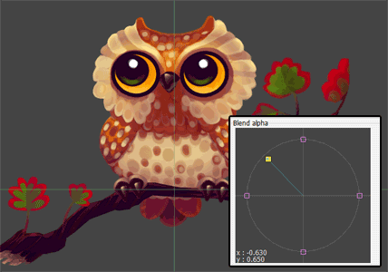

how is it? Did it move?<br>
どうです？動きましたか？


# How to export images
<a name="howto_export"></a>

Let's output the owl to **sequential number image**.<br>
先ほど作ったowl（フクロウ）を **連番画像** に出力してみましょう。

## Change mode

To output, switch to **Animation test mode (F5)**.<br>
出力するには **Animation test mode(F5)** に切り替えます。


In this mode, you can check the animation combination.<br>
このモードは作ったアニメーションを組み合わせて、動作を確認するモードです。

## Setup

Let's select **Export images (shift + ctrl + alt + E)** from the menu.<br>
ではメニューから **Export images(shift+ctrl+alt+E)** を選んでみましょう。

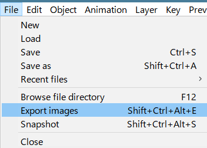

Error!!!


You need to set the canvas size.<br>
出力するにはキャンバスサイズを設定する必要があります。

Select **global** from the side panel.<br>
サイドパネルから **グローバル** を選択。


Pink line is canvas size. Surround the owl.<br>
ピンクの線がキャンバスサイズ。フクロウを囲います。


Let's select **Export images** again. Error!!!<br>
もう一度メニューから **Export images(shift+ctrl+alt+E)** を選んでみましょう。Error!!!


At least one animation must be set.
Set the animation in the right panel.<br>
1つ以上アニメーションを設定する必要があります。
右側のパネルでアニメーションをセットしましょう。

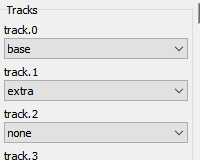

The order is very important.
Make the extended-pose overlap the base-pose.
Let's play it and see if it animates correctly.<br>
順序は重要です。
基本ポーズに拡張ポーズを重ねるようにしましょう。
再生させて正しくアニメーションするか確かめましょう。

Let's select **Export images** again.<br>
もう一度メニューから **Export images** を選んでみましょう。

## Export settings

Do the output settings.<br>
出力設定を行います。

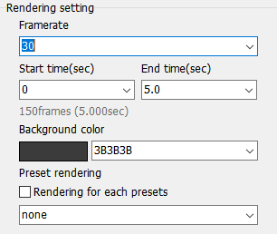

Set the background, frame rate, and duration (total time).
In this case, 150 images are output.<br>
背景、フレームレート、長さ（時間）を設定します。
この場合、30*5で150枚の画像を出力します。

`Preset rendering` is not use, disable it.<br>
`Preset rendering` は使わないので無効に設定してください。

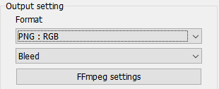

The output format is `PNG : RGB`. Output as a PNG file.
If attached opacity(alpha), you can select `bleed` or `PreMultipliedAlpha(PMA)`.
This time is unnecessary.<br>
出力形式は `PNG : RGB` 。PNGファイルで出力します。
不透明度(alpha)を付加する場合は、`bleed,PreMultipliedAlpha(PMA)` から選択できます。
今回は不要です。

If you install FFmpeg, you can output to mp4 etc.<br>
FFmpegをインストールすれば mp4 などにも出力も可能です。


The file name includes special symbols for sequential numbers.
`{frame}` is replaced with the frame number.<br>
ファイル名には連番のための特殊記号が含まれています。
`{frame}`はフレーム番号に置き換わります。

```
setting : images{frame}
output : images0001 , images0002 ...
```

Set the output directory with a relative path from animrig file.<br>
出力先はこのファイル(*.animrig)からの相対パスで指定します。

```
setting : output\
animrig file : c:\hoge\sample01\sample.animrig
output : c:\hoge\sample01\output\
```

Press the **export** button to get started.<br>
**export** ボタンを押して開始しましょう。

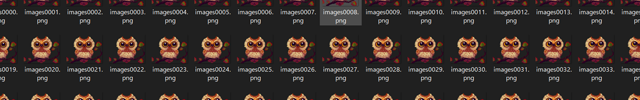

Was it output?<br>
出力されましたか？

# How to physics
<a name="howto_physics"></a>

Let's use **physics** simulation.<br>
物理計算を使ってみましょう。

Physics simulate real motion, but they also help make animations.
You can easily make the swing motion that is difficult to do manually.<br>
物理計算はリアルをシミュレートするものですが、アニメーションの作成を手助けするものでもあります。
手付けでは難しい揺れる動きが簡単に作れます。

## Settings on Spine

As a sample, Use Spine's official sample "raptor".
The data is in `editor/sample_data/raptor/`.
Let's replace the tail with physics motion.<br>
サンプルとして、Spine公式の raptor さんを使います。
データは `editor/sample_data/raptor/` にあります。
尻尾の部分を物理計算に置き換えてみましょう。

Load it with Spine and check the animation.<br>
Spineで読み込んでアニメーションを確認します。


In this file, the animation of the tail part has been deleted.<br>
このファイルは尻尾の部分のアニメーションが削除されています。

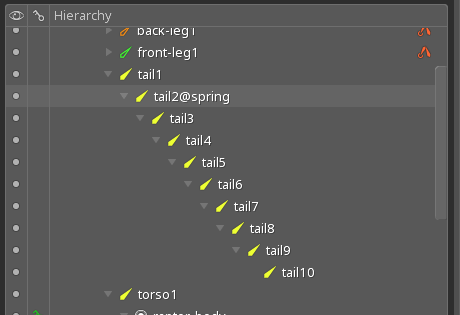

Also, the tail bone name has been changed to `tail2@spring`.
Add `@spring` to the end of the name to enable physics.
In this case, physics is applied from `tail2` to` tail10`.<br>
また、尻尾のボーンの名前が `tail2@spring` に変更されています。
`@spring`を名前の後ろに追加すると物理計算が有効になります。
このケースでは `tail2` から `tail10` まで物理計算が適用されます。

## Settings on Animationrig

Let's load it with SpineAnimationrig.<br>
では、SpineAnimationrigで読み込んでみましょう。


The physics bone part is displayed in pink.<br>
物理計算の部分がピンク色で表示されます。

Let's play the `walk` animation.<br>
キーを追加して、`walk`アニメーションを再生してみましょう。


Oops! It looks like a snake and is creepy...<br>
うわ！気持ち悪い！ヘビみたいですね。

Then, set the physics settings. Adjust settings by writing text.<br>
では、物理計算の設定を行います。設定はテキストを書いて調整します。

Select **object** in the right side panel , and open **settings**.<br>
右のサイドパネルの **object** を選んで、**settings** を開いてください。

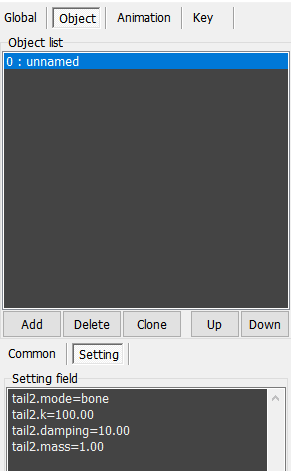

Press the **Refresh setting text** button below to add the current settings.<br>
下の **Refresh setting text** ボタンを押すと現在の設定が追加されます。

```
tail2.mode=bone
tail2.k=100.00
tail2.damping=10.00
tail2.mass=1.00
tail2.alpha=1.0
```

Settings format is `{bone}. {property}`.
These are the default setting. 
This values are used if settings text is nothing.<br>
`{bone}.{property}` という書式になっています。
上記がデフォルト設定であり、なにも書かれていない場合はこの値が使用されます。

See <a href="#physics">physics</a> for details. see later.<br>
詳しくは <a href="#physics">physics</a> で説明していますが、後で見てください。

Double click on the setting text to open the configuration form.
Use it if you need advanced settings.<br>
テキストの個所をダブルクリックすると設定フォームが開きます。
複雑な設定が必要な場合は使ってください。


|property||
|---|---|
|mode|Spring model.|
|k|Spring power. Swing.<br>バネ係数。揺れ。|
|damping|Force decay.<br>力の減衰率。|
|mass|Mass of object.<br>物体の質量。|
|alpha|Physics blend ratio.<br>物理計算のブレンド率。|

Please set with feeling. I'm not sure too!<br>
となっています。が、適当に設定してください。私も良くわかりません！

Adjust with `k` and `damping`,
Increase or decrease the `mass` value if you do not get a good motion.<br>
`k` と `damping` で調整して、良い動きにならなかったら `mass` を増減させてください。

```
tail2.mode=bone
tail2.k=200.00
tail2.damping=10.00
tail2.mass=0.4
tail2.alpha=1.0
```

Change to this settings.<br>
この設定に変更します。

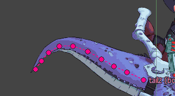

It feels nice.<br>
良い感じですね。

<video width="auto" height="400" controls loop>
<source src="images/howto_physics_raptor02.mp4" type="video/mp4">
</video>

Let the raptor do the sequence animations.
It moves like this.<br>
一連の動きをさせるとこのように動きます。

There is also a negative effect due to physics.
The scene of the `roar` animation has become subtle difference.
So I made a supplementary animation of the tail and combined it with physics.
That is why the tail and the pink bone are different.<br>
物理計算故の弊害もあります。
`吠える` アニメーションのシーンが微妙になってしまいました。
そこで、尻尾の部分の補足アニメーション作って、物理計算と組み合わせました。
尻尾とピンクのボーンが異なるのはそのためです。

Finally, Make overall adjustments.<br>
最後に、全体の動きを調整しましょう。

Maybe the effect of physics is too great.
In this case, adjust the blend ratio `alpha` of the physics.<br>
ちょっと物理計算の影響が大きすぎるかも。
この場合は物理計算の合成率 `alpha` を調整しましょう。

```
tail2.alpha=0.6
```
<video width="auto" height="300" controls loop>
<source src="images/howto_physics_blend01.mp4" type="video/mp4">
</video>

Just feeling good.<br>
こんなもんでしょうか。