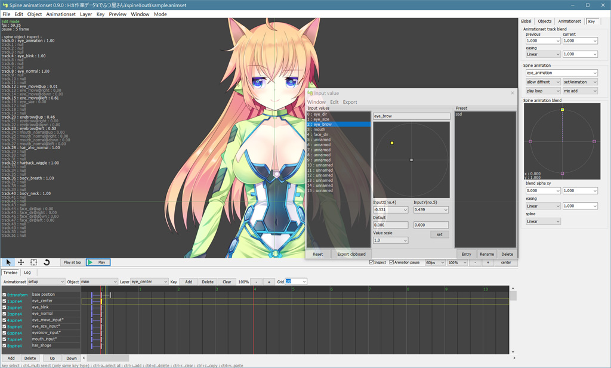
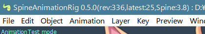
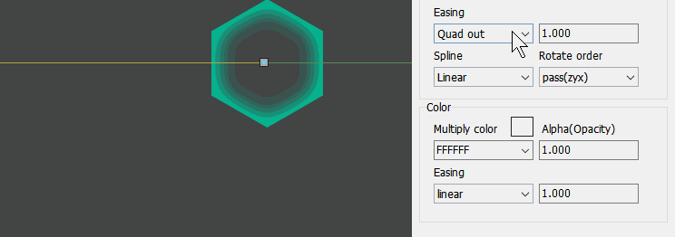
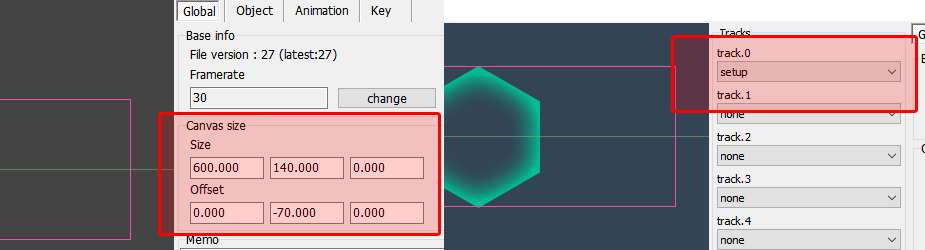
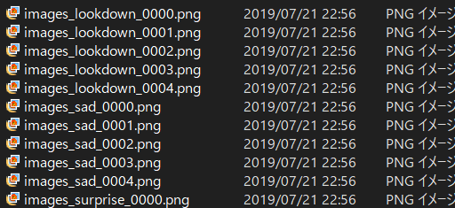
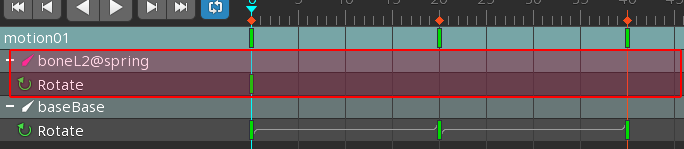
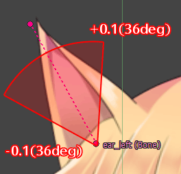
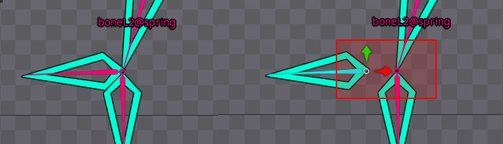
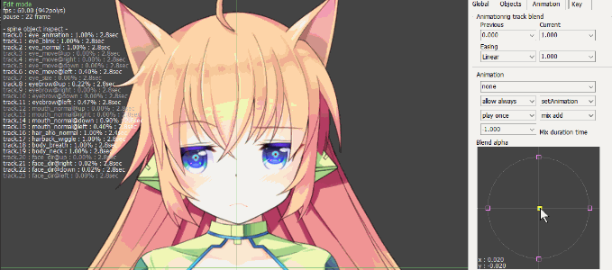
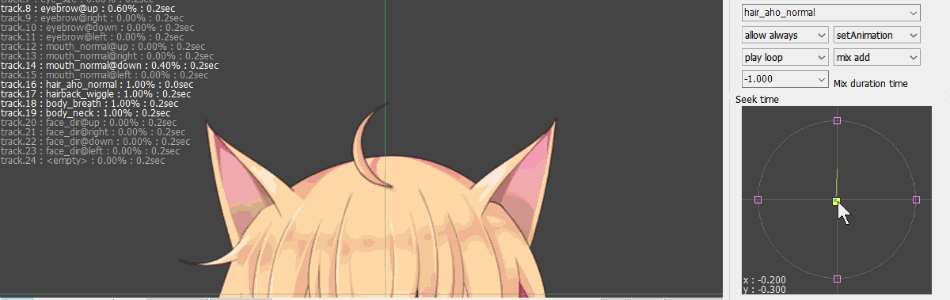

# SpineAnimationRig manual



This software is **free-software**.<br>
このソフトウェアは**フリーソフトウェア**です。

Control Spine animation by timeline. This editor-application has functions such as switching animations, building tracks, and assigning values ​​from application side.<br>
タイムラインによるSpineアニメーションのコントロールを行います。アニメーションの切り替え、トラックの構築、アプリケーションからの値の代入などの機能を持ちます。

This Editor was created for "facial control" where more animations (tracks) are composited. If you want to control a animation that needs a lot of tracks, please try it :)<br>
このエディタは合成するアニメーション（トラック）が多く必要となる”表情制御”用に作られました。もし多くのトラックを必要とするアニメーションを制御したいなら、一度お試しください。

# Caution

This editor(SpineAnimationrig.exe) is provided for each version of Spine. 3.8 was officially released, we are developing mainly 3.8.<br>
エディタ（SpineAnimationrig.exe)はSpineのバージョンごとに用意されています。3.8が正式リリースされたので、3.8をメインに開発しています。

Please refer to [File-Version](#fileversion).<br>
詳しくはファイルバージョンを参照ください。

# Contact , Support , Product homepage

Please access the following :)<br>
以下よりアクセスしてください。

* [https://ko-ta2142.github.io/SpineAnimationrigPage/](https://ko-ta2142.github.io/SpineAnimationrigPage/)
* [https://sameasm.net/spineanimationrig/](https://sameasm.net/spineanimationrig/)


# Contents

* Basic
    * [Spine License](#license)
    * [Overview](#overview)
    * [Features](#features)
    * [Data structure](#data)
    * [File version compatibility](#fileversion)
* GUI
    * [Preview area](#previewform)
    * [Timeline area](#timelineform)
    * [Property area](#propertyform)
    * [Input value form](#inputform)
    * [AnimationTest mode](#animationtest)
    * [Export images , Snapshot](#exportimages)
    * [Physics](#physics)
* Spine
    * [Empty animation](#spine_empty)
    * [Skin](#spine_skin)
* Object
    * [Common object](#commonobject)
    * [Null object](#nullobject)
    * [Spine object](#spineobject)
* Layer
    * [PreviousKey](#previouskey)
    * [Common layer](#commonlayer)
    * [animation blend layer](#animblend4layer)
    * [animation seek time layer](#seekblend4layer)
    * [Transform layer](#transformlayer)
    * [Event layer](#eventlayer)
    * [Priority layer](#prioritylayer)
    * [State (enable visible) layer](#statelayer)

# License
<a name="license"></a>

## Spine

Even if you do not have a Spine-License, you are allowed to use Spine in the editor.<br>
Spineライセンスを持っていなくても、エディタ上でSpineを自由に使用することが許されています。

To edit Spine files, you need to purchase Spine-Editor and a license. This editor mainly uses pro-version features.<br>
Spineファイルを編集する場合はSpine-Editorとライセンスを購入する必要があります。このエディタでは主にプロバージョンの機能が使用されます。

* Spine

[http://esotericsoftware.com/](http://esotericsoftware.com/)

# Overview
<a name="overview"></a>

**SpineAnimationrig** is not a video output application. It is for easy control of Spine on the application<br>
この**SpineAnimationrig**は動画を出力するアプリケーションではありません。アプリケーション上でSpineの操作を簡略化するための物です。


Please refer to the "runtime readme".<br>
詳しくはランタイムのreadmeを参照ください。

This editor does not support some features of Spine. If you get an accurate display(output image), you need to create an application using Unity etc.<br>
このエディタはSpineの一部機能をサポートしていません。ちゃんとした出力（表示）を得たい場合は、Unityなどでアプリケーションを作る必要があります。

# Features
<a name="features"></a>

* 4 Directions animation blend.

Assign four animations up, down, left and right, and combine them. It is often used in facial expression.<br>
4つのアニメーションを上下左右に割り当てて合成します。表情操作ではおなじみの機能です。

* Time-stretch(seek) animation blend.

Control playback time(time stretch). It is often used in movie-editor.<br>
再生時間を制御してタイムストレッチを行います。動画編集ではおなじみの機能です。

* Multi track Animationrig-animation.

Animationrig also has a track feature. Multiple animations can be combined.<br>
このAnimationrigファイルにもトラックがあり、複数のアニメーションを合成できます。

* Control animation-values from application. (input values)

The object has variables (input-value), It can be embedded in property values ​​on the timeline. you can design easing and timing, It is safer and easier to handle than overwriting the value directly.<br>
オブジェクトは自由に使える変数(input-value)を持っており、この変数をタイムライン上のプロパティ値として使用することが出来ます。イージングやタイミングをデザインすることが出来、直接値を上書きするよりも安全かつ簡単に扱うことが出来ます。

* Physics

Animationrig has a simple spring physics model. You can give spine physical behavior without using Unity.<br>
簡単なバネ物理モデルが使用可能です。Unityを使わずに物理的な挙動を与えることが出来ます。

# Data structure
<a name="data"></a>

```
AAA animation
    * spine object
        + transform layer
        + spine layer
        + spine layer
    * null object
        + transform layer
BBB animation
    * spine object
        + transform layer
        + spine layer
        + spine layer
    * null object
        + transform layer
```

Objects and Layers structure is shared between animations.
If delete a layer, Affects all animations.<br>
アニメーション、オブジェクト、Layer、その下にKeyのデータを持ちます。
オブジェクトとLayerの構成は、アニメーション間で共有され、常に同じ構成を取ります。
もしLayerを削除すれば、全アニメーションに反映されます。

# File verion compatibility
<a name="fileversion"></a>

## Animationrig file compatibility

The editor or runtime can read all old version files (**backward compatible**).<br>
基本的に、エディタやランタイムは古いバージョンのファイルをすべて読み込むことができます（**後方互換性**）。

The version of the Animtionrig file and Spine-loader are displayed in the form caption.<br>
Animtionrigファイルのバージョン、Spineローダーのバージョンはフォームキャプションに表示されます。



|||
|---|---|
|rev|Editor build revision|
|latest|Animationrig file version|
|Spine|Spine file loader version|

## Spine loder(runtime) compatibility

Spine-runtime-loader has not backward compatible. Please output the file in a near version.<br>
Spine-runtimeのローダーは後方互換性を持ちません。近いバージョンでファイル出力してください。

In principle, Editor is Used the latest runtime(loder) for each major version.<br>
原則として、エディタは大きなバージョンごとに最新のランタイムを使用しています。

## Spine runtime 3.6

Spine-runtime needs ver 3.7 or more to use MixAdd. So the editor does not support 3.6.<br>
MixAddを使用するには3.7以上が必要です。なので、エディタは3.6に対応しません。

But, can be run at runtime level using 3.6. Please refer to the runtime readme.<br>
が、ランタイムレベルでは3.6を使って実行が可能です。ランタイムのreadmeを参照ください。

# Preview area
<a name="previewform"></a>


Display a preview of the current state.<br>
現在の状態のプレビューを表示します。

## Shortcut

|keys|function|
|---|---|
|space|play.|
|shift + space|play at top.|
|mouse right|move view position.|
|mouse wheel|zoom.|

## Option

|button|function|
|---|---|
|inspect|show inspect of current object<br>現在オブジェクトの内容を表示|
|stop animation|stop animation in edit mode<br>編集中のアニメーションを停止|
|fps|preview frame rate|

## Edit handle

Edit-handle-mode can be used when selected **Transform layer**.

この機能は**トランスフォームLayer**を選択中の場合のみ使用出来ます。

|handle|function|
|---|---|
|select|object select|
|move|edit position|
|scale|edit scale|
|rotate|edit rotate|

# Timeline area
<a name="timelineform"></a>


Show the animation timeline. Edit layers and keys.<br>
選択中オブジェクトのLayer構造を表示します。

## Shortcut

|keys|function|
|---|---|
|space|play.|
|shift + space|play at top.|
|mouse left|select key.|
|shift + mouse left|grid time.|
|mouse right|move view time position.|
|mouse wheel|time zoom.|
|ctrl + mouse left|multi select.|
|ctrl + a|select all keys in layer.|
|ctrl + i|add key.|
|ctrl + r|clear key.|
|ctrl + d|delete key.|
|ctrl + shift + i|add layer.|
|ctrl + shift + r|clear layer.|
|shift + ctrl + d|delete layer.|

## Layer
<a name="layer"></a>
Can be edit layers in object. Layer names are shared between animations.
Execute order by up to down.<br>
オブジェクトが持つLayerを編集出来ます。名前はアニメーション間で共有されます。実行は上から下へ順に行われます。

## Key , PreviousKey
<a name="key"></a>

Layer has normal-key and **PreviousKey**. PreviousKey Holds the previous (changed)animation values. 
This key is used to control transition of animation switching.<br>
Layerには通常Keyと**PreviousKey**が存在します。
PreviousKeyは変更前のアニメーションの状態を保持します。このKeyはアニメーション切り替えの遷移を制御する時に使用します。

However, there are **[AutoFade](#animationtest)** for animation switching control. It is a function to automatically crossfade to feel good. leave it to you.<br>
しかし、アニメーションの切り替え制御には **[AutoFade](#animationtest)** があります。良い感じに自動でクロスフェードする機能です。どちらを使うかはお任せします。

## Overlap key


Allow overlapping keys on Animationrig. It is useful for jumping position. It becomes pink color.<br>
AnimationrigではKeyの重複を許容します。これは座標をジャンプさせる場合に役立ちます。重複するとピンク色になります。

# Property area
<a name="propertyform"></a>


View and edit information of objects, animations, and keys.<br>
オブジェクト、アニメーション、Keyなどの情報を表示、編集します。

## Mouse edit , Edit form

<br>


Some properties can be edited with the mouse. You can also show the input form by double click.<br>
一部のプロパティはマウスによる編集が可能です。またダブルクリックで入力フォームを表示することが出来ます。

## Global

|property||
|---|---|
|Frame|Timeline framerate<br>タイムラインのフレームレート|
|Memo|User memo. Please use it freely!<br>ユーザー用メモ領域。ご自由に。|

## Object

Please referrence **[ObjectType](#objecttype)** page.<br>
オブジェクト項目を参照ください。

## Animation

|property||
|---|---|
|Name|animation name.|
|Preview base animation|Preview only. Setup and run base animation.<br>プレビュー専用。下地となるアニメーションの再生。|
|loop ennable<br>loop disable|Loop active.|
|beginframe|Loop begin frame.|
|endframe|Loop end frame.|

## Key

Please referrence **[LayerType](#layertype)** page.<br>
Key項目を参照ください。

# AnimationTest mode
<a name="animationtest"></a>


This application also supports animation track blending. You can check and preview in **AnimationTest mode**.<br>
このツールにもアニメーションを重ねる機能があります。
重ねた際の動きをプレビューしたい場合はモードを**AnimationTest**に切り替えます。

## Shortcut

|key|function|
|---|---|
|F6|switch mode.|
|space|play.|
|shift + space|play at top.|

## Auto fade

It is a function that can be used at runtime.<br>
ランタイムの機能です。

It is a function to crossfade the switching of animation to a good feeling. 
It was born because the fade setting with PreviousKey is very difficult. 
It is a rough control, but a very powerful(useful) feature.<br>
アニメーションの切り替えを良い感じにクロスフェードさせる機能です。PreviousKeyによるフェード設定が大変なため生まれました。大雑把ですが強力な機能です。

* disable


* enable


# Export images , Snapshot
<a name="exportimages"></a>

You can output the rendered result as an image.<br>
レンダリング結果を画像出力することが出来ます。

The following settings are required to output.<br>
出力するには以下の設定が必要になります。

* **Canvas Size** is set in the Global panel.<br>グローバルパネルのキャンバスサイズが設定されていること
* The track-animation is set in the **AnimationTest-mode**.<br>アニメーションテストモードのトラックが設定されていること



## Setting


|property||
|---|---|
|Framerate|Output rendering framerate.|
|Start frame , End frame|Time area.|
|BGColor|Background color. Used only on **RGB** format.|
|Preset rendering|Output for each preset. Set a target object to apply Preset.<br>プリセットごとに動画を出力します。プリセットを適用するオブジェクトを設定してください。|


|property||
|---|---|
|Format|Output image format.<br>RGB : color<br>ARGB : color + alpha<br> A : alpha grayscale|
|Bleed,PreMultiplyAlpha|Color blend calculation. Used only on **ARGB** format.|
|Base filename|Sets the output file name format. File-exe is unnecessary.<br>出力ファイル名のフォーマットを設定します。拡張子は不要です。|
|Output directory|Set by relative or absolute output directory path.<br>出力パスを相対、または絶対パスで指定します。|

## Preset output

When Preset rendering is enabled, batch output for each preset.<br>
Preset renderingを有効にすると、プリセットごとに一括出力します。

```
filename format : images_{preset}_{frame}
```



## Snapshot

Outputs the current editing status as a still image. It is useful when you want only an image easily.<br>
現在の編集状態を静止画で出力します。簡単に画像だけ欲しい場合に便利でしょう。

You do not need to set ExportImages. Output with ARGB(Bleed) 32 bit PNG.<br>
ExportImagesの設定は必要ありません。ARGB32bit(Bleed)のPNGで出力します。


# Input value form
<a name="inputform"></a>


In this application, it can be use values ​​input from the external program(embedded application) into the timeline.<br>
このアプリケーションでは外部（組み込みアプリケーション）から入力された数値をタイムラインで使用することが出来ます。

## How to set input-value


If you use value from external, Set a special value to Key propertys.
Please select a value from the **right click menu**.<br>
外部からの変数を使用する場合は、Keyのプロパティに特殊な値を設定します。
右クリックメニューから変数を選んでください。

## Preset


You can store(save) the state of values.
It is saved as **preset.txt** in the same location as the file.<br>
値の状態を記憶しておくことが出来ます。
この情報はファイルと同じ場所に**preset.txt**で保存されます。

## Export to clipboard

Export the state of all values to clipboard.
You can edit the output text format with **export-menu**.<br>
値の情報をクリップボードにコピーします。
出力テキストのフォーマットは**exportメニュー**より設定が可能です。

|replace word||
|---|---|
|{value0}|write value by index.<br>インデックス番号の値を出力。|
|{set0.x}<br>{set0.y}|By XY index.<br>XYセット番号で指定。|
|{name.x}<br>{name.y}|By XY name.<br>XYセット名で指定。| 

* format
```
eye:{ position:[{eyepos.x},{eyepos.y}] , size:[{eyesize.x},{eyesize.y}] }
```
* output
```
eye:{ position:[0.400,0.200] , size:[0.100,0.000] }
```

# Physics
<a name="physics"></a>

<video width="auto" height="500" controls>
<source src="images/physics_sample.mp4" type="video/mp4">
</video>

Animationrig supports simple physics model (spring model). You can easily apply physics expressions that are difficult **without Unity** to **Spine**. Accuracy and behavior are never perfect, But I think it can be used enough to express swaying hair.<br>
簡単な物理計算（バネモデル）を搭載しています。Unityを使わないと難しい物理計算を、簡単にSpineに適用できます。精度も機能も決して良い物ではありませんが、髪の毛を揺らしたりする分には十分使えると思います。

Runtime support is not yet available. We will work after solving some problems.<br>
ランタイムでのサポートはまだできておりません。もう少し仕様が固まってから反映します。

## How to set physics

In the Spine editor, add **@spring** to the end of the bone name. Apply physics to that bones and children bones.<br>
Spineエディタで、bone名に **@spring** を語尾に付け加えてください。そのボーンを含む子に対して物理計算を適用します。


In this image, **boneL2** and **boneR2**, two physics groups are created.<br>
画像では **boneL2** と **boneR2** 、２つの物理計算グループが作られます。

## Alias name

If you want to use the same settings for multiple groups, set an alias name.<br>
複数のグループに同じ設定を使用したい場合は、エイリアス名を設定します。

```
bone01@spring,{alias name}
```
```
sidehair_l1@spring,hair
  sidehair_l2
    sidehair_l3
sodehair_r1@spring,hair
  sidehair_r2
    sidehair_r3
```
These two groups use a setting with the **hair** name.<br>
この２つのグループは、名前が **hair** の設定を使用するようになります。
```
hair.mode=bone
hair.k=100
```

## Physics terminator

To set the end of the group, use **@end**.<br>
グループの終端を指定する場合は **@end** を使用します。

```
boneL2@spring
  boneL3
    boneL4
      boneL5@end
        boneL Accessory01
        boneL Accessory02
        boneL Accessory03
  boneSubL3@end
    boneSubL4
      boneSubL
```
In the case, Affects the boleL3-angle and boneL4-position from boneL2. **boneSub** branch is excluded.<br>
この場合、boneL3の角度、boneL4の位置まで影響を与えます。枝分かれしている **boneSub** はグループから除外されます。

## Bone setting

Only default settings are supported for physics bone setting. Cannot disable rotation from parent.<br>
また物理計算が対象となるボーンの設定は、現在デフォルト設定のみの対応となります。親からの回転を無効化したりは出来ません。


Also, animation cannot be set it. The bone posture is overwritten and not displayed correctly.<br>
また、アニメーションを設定することもできません。姿勢が上書きされてしまい、正しく表示されません。



## Spring setting

Physical settings are edited on the Animationrig editor. Edit with **setting memo**.<br>
物理計算の設定はAnimationrigエディタ上で行います。オブジェクトの **setting memo** で編集します。

At first there is nothing(use default setting). Please push the **Refresh setting text** button. The settings are written to text area.<br>
最初はなにも無い状態（デフォルト設定が適用）なので **Refresh setting text** ボタンを押してください。設定が書き込まれます。


```
{physics group name / alias name}.{property name}=value

boneL2.k=100
```

Property is below. Use lowercase , Space is not allowed.<br>
指定できるプロパティは以下の通りです。小文字で表記、スペースなどは入れないでください。

The physics calculation frame rate is fixed at 100 fps (dt=0.01).<br>
物理計算フレームレートは100fps(dt=0.01)固定です。

|property||
|---|---|
|**basic**||
|enable (def:true)|Used for disabling.<br>主に無効化する際に使用します。<br>example : aaa.enable=false
|mode (def:bone)|Spring mode. Choose from **bone,strbone,point,strpoint**. reference below.<br>バネのモードを設定します。詳しくは以下参照。|
|k (def:100)|Spring constant. Larger , more amplitude(swing).<br>バネ定数。値が大きいほど振幅します。|
|damping (def:10)|Velocity damping value.<br>速度減衰値。|
|mass (def:1.0)|Mass, weight. Larger , move slowly.<br>質量、重さ。大きいほどゆっくり動きます。|
|**gravity**||
|gravity (def:0.0)|Unsupported. Gravity power. I think ,not used it often.<br>現在未対応。重力。バネではあまり使わないと思います。|
|gravityvector (def:0,-1,0)|Unsupported. Gravity direction.<br>現在未対応。重力方向。<br>example : aaa.gravityvector=0,-1,0|
|**limitter**||
|limitvelocity (def:1000)|Limit the velocity.<br>速度制限値。|
|limitangle (def:-1.0,+1.0)|Limit the angle. Set the relative value from the natural angle.<br>角度(360=1.0)を制限します。自然角度からの相対値で指定します。<br>example : aaa.limitangle=-0.12,0.12|
|limitmove (def:65535.0)|Limit the moving range. Set the distance from the natural position. The value set the ratio of spring length.<br>移動範囲を制限します。自然位置からの距離で設定、値はバネの長さの比率を使います。<br>example : aaa.limitmove=0.5|
|| |


## Spring mode


There are four types of springs : **bone,strbone,point,strpoint**. Each mode has the characteristics of returning to original shape.<br>
バネには **bone,strbone,point,strpoint** の４種類があります。ケースにより使い分けましょう。どれも元の形状に戻ろうとする性質を持ちます。

* bone

The length is a fixed. Affects bone angle(rotate). Used for accessory and ahoge-hair(anime hair).<br>
長さが固定のバネで、ボーンの角度に影響を与えます。アクセサリやアホ毛に最適です。

* strbone

This mode can stretch in bone length. Not used often.<br>
伸び縮みする **bone** です。あまり出番はありません。

* point

The length is a fixed. Affects bone position. Used for hair and cloth.<br>
長さが固定のバネで、ボーンの位置に影響を与えます。髪の毛や布に最適です。

* strpoint

Basic spring. Swiiiiing! Affects bone position. Used for breast and body sagging.<br>
基本的な伸び縮みするビヨンビヨンするバネです。ボーンの位置に影響を与えます。胸や体のたるみに最適です。

## Attention of bone angle

The spring is a model that controls the position. So, there is a limit to the bone structure in the **bone,strbone** mode that controls the angle.<br>
バネは位置をコントロールするモデルです。そのため角度を制御する **bone,strbone** モードではボーン構造に制限があります。

Basically, **bone,strbone** should be constructed with **straight structure** where the bones **do not branch**.<br>
基本的に **bone,strbone** ではボーンが枝分かれしない **直線構造** で組んでください。

If the bone branches off, The bone positions must be the same.<br>
もしボーンが枝分かれする場合、ボーンの位置を同じにする必要があります。



If the position is different, Does not display correctly.<br>
もし位置が離れている場合は、正しく表示されません。

## How to give better force

When rotating, it seems that force does not apply well. In that case, it is recommended to disable rotation from the parent.<br>
位置の移動に対しては良い動きをしますが、回転に関してはうまく力が伝播しにくいようです。その場合、親からの回転を切るのがお勧めです。


It cannot be set for physics bones. It ’s a good idea to add a bone in front.<br>
物理計算ボーンには設定できないので、手前にボーンを追加してやるといいでしょう。

This technique is very useful for hair.<br>
髪の毛などでとても使えるテクニックです。


# Empty animation
<a name="spine_empty"></a>


Spine's **empty-animation**(SetEmptyAnimation) is a function that restores the default pose (setup). However, be careful when using it because it behaves a bit specially.<br>
はSpineの **empty-animation**(SetEmptyAnimation)はデフォルトポーズ(setup)に戻す機能です。が、少し特殊な動きをするので、使用には注意を払ってください。

## Remove animation

There is no problem when erasing the animation. Fade to default pose at trasition time.<br>
アニメーションを消す場合は問題ありません。遷移時間でデフォルトポーズにフェードします。

**track** is then initialized to **null**.<br>
その後、**track** は **null** に初期化されます。

## Entry animation on null track

Spine will not fade animation if **track** is **null**. This behavior may cause the animation to be skipped.<br>
Spineは **track** が **null** の場合、アニメーションがフェードしません。この挙動はしばしばアニメーションが飛ぶような挙動を生み出します。

## Best practice


Best practice is not to use **empty**. Make an animation with Spine that does nothing (no key) in advance. Use this animation instead of **empty**.<br>
最善策は、**empty** を使用しないことです。あらかじめ何もしない（keyが１つも存在しない）アニメーションをSpineで作っておきましょう。このアニメーションを **empty** の代わりに使用しましょう。

# Skin

The default treatment for skins depends on the spine-runtime version. In 3.7, restor the setup state skin. But, In 3.8, selected nothing (not visible).<br>
スキンはデフォルトの扱いがspine-runtimeのバージョンによって異なります。3.7ではsetupの状態を復元しますが、3.8では何も選択されていない状態を復元します（表示されない）。


There is DefaultSkin in the setting of the Spine object. Select a skin to display in the default state.<br>
Spineオブジェクトの設定に DefaultSkin があります。デフォルト状態で表示するスキンを選択してください。


# Object type
<a name="objecttype"></a>

# Common Object
<a name="commonobject"></a>
Shared property of all Objects.<br>
全Objectタイプで使用される共通プロパティです。

|property||
|---|---|
|**common**||
|name|Object name. Allow duplicate names.|
|enable|Update & show object.|
|visible|Show object.|
|offset|Offset position.|
|scale|Base scale.|
|Group (parent object)|Inherit(link) the position, scale and etc from parent object.<br>親objectの位置などを継承します。|
|Draw Priority|Design draw priority order.|
|**setting**||
|setting|Setting text field. Used mainly for physics setting.<br>設定用テキスト。主に物理計算設定などに使用されます。|


# Null Object
<a name="nullobject"></a>

Null object. Not displayed by default.<br>
空オブジェクト。デフォルト状態では表示されません。ユーザが拡張して意味を持つオブジェクトです。

You can display the temporary image.<br>
仮画像を表示することが出来ます。

# Spine Object
<a name="spineobject"></a>

This object controls the **spine** file.<br>
**spine**をコントロールするためのオブジェクトです。

Spine file-path is recorded with relative path.
Please be careful not to include personal information such as desktop pass.<br>
spineファイルは相対パスで記録されます。**パスに個人情報が入らないようにご注意ください。**

### preview support function

Editor support status.<br>
エディタ上での表示対応状況です。

|function||
|---|---|
|blend|yes|
|tintcolor|no (diffuse * modulatecolor + tintcolor)|
|mask| no|

### property

|property||
|---|---|
|filename|spine exported file. Please use **JSON** format that is as compatible as possible<br>spineのexportファイルを指定します。出来るだけ互換性の高い **json** 形式を使用しましょう。|
|mix duration|default mix duration time.|
|PreMultiplyAlpha|Change the blending method to PreMultiplyAlpha.<br>ブレンドをPreMultiplyAlpha方式に切り替えます。|
|Default skin (def:default)|Set starting skin name. <br>開始時のスキン名を指定します。|

# Layer type , key property
<a name="layertype"></a>

# PreviousKey
<a name="previouskey"></a>


**[PreviousKey](#key)** is displayed in blue color。You can not edit the value or time. 
Only easing can be set.<br>
**[PreviousKey](#key)** は青色で表示されます。値や時間は編集できません。イージングのみ設定することが出来ます。

# Common layer
<a name="commonlayer"></a>

Shared property of all layers.<br>
全Layerタイプで使用される共通プロパティです。

## track blend

Set the blend-weight when mixing animation.
The blend calculation is below.<br>
アニメーションを重ねた場合の値の比重を設定します。
計算は以下になります。

```
track0 ... previous track
track1 ... current track

out = (track0.AlphaX * previous) + (track1.AlphaX * current)
```

* Add (default)

Default is 1.0. Add blend.<br>
デフォルトは 1.0 で加算です。

```
previous : 1.0
current : 1.0

out = track0.AlphaX * 1.0 + track1.AlphaX * 1.0
    = track0.AlphaX + track1.AlphaX
```

* replace

In the case of replace.<br>
上書きする場合。

```
previous : 0.0
current : 1.0

out = track0.AlphaX * 0.0 + track1.AlphaX * 1.0
    = track1.AlphaX
```

# Transform layer
<a name="transformlayer"></a>

## move , scale , rotate

Control move, scale, and rotate.

## easing

value transaction.<br>
値の遷移を選択します。

## spline

Performs curve interpolation using the values ​​of the 4 keys.<br>
前後4Keyの値を使って曲線補間を行います。

## rotate order

Select X,Y,Z rotation order.
**pass** will use the previous settings when mixing animations.<br>
回転の順序を指定します。
複数のアニメーションを重ね合わせた場合、**pass**は前の値を引き継ぎ、使用します。

## Multi transform-layer composite

If you set multi-layers, values ​​will be composite from top to bottom.<br>
もし複数のLayerを設置した場合、値は上から下へ合成（行列合成）されていきます。

# Animation blend layer
<a name="animblend4layer"></a>



Composite animations with using 4(or 1) tracks on spine.<br>
**spine**の4(または1)トラックを使用して、アニメーションを合成します。

## Animation name format (spine side)

Spine-animations are assigned in 4 directions (up, down, left, right) by name.<br>
Spineアニメーションは名前規則にそって4方向（上下左右）に割り当てられます。


|name format||
|---|---|
|name<br>name@up|up (+Y)|
|name@right|right (+X)|
|name@down|down (-Y)|
|name@left|left (-X)|

If not exists animation, **empty** will be set.<br>
空アニメーションには**empty**が設定されます。

## name

Set Spine-animation name.<br>
Spineアニメーション名指定します。@以降は不要です。

|name||
|---|---|
|none| pass set animtion.<br>パスします。<br>
|empty| set empty animation.<br>emptyアニメーションを設定します。

## allow

Execution allow from animation name.<br>
アニメーション名を比較、実行を許可、禁止します。

|property||
|---|---|
|allow diffrent|Only if dirrent name.<br>名前が異なる場合のみ|
|allow always|Always execute.<br>常に許可。|

## setAnimation , addAnimation

|property||
|---|---|
|setAnimation|Change now!<br>今すぐアニメーションを変更する。|
|addAnimation|Change at end point.<br>終端でアニメーションを切り替える。|

## play

|property||
|---|---|
|play one|One shot.|
|play loop|Loop.|

## mix blend

Sets the animation blending method between tracks.<br>
spineのトラック間の合成方法を設定します。

|property||
|---|---|
|mixReplace|Replace mode.<br>置き換えモード。|
|mixAdd|Add mode. Combine multi animations.<br>加算モード。複数のアニメーションを合成します。|

## mix duration time

Over write the animation mix blend duration-time.<br>
アニメーション繊維時間を上書きします。

|property||
|---|---|
|-1.0|Use default mix duration.<br>spineに設定に委ねます。|
|0.0|disable mix animation.<br>アニメーションミックスを行いません。|


# Animation seek time layer
<a name="seekblend4layer"></a>



Composite **time-stretched** animations with using 4(or 1) tracks on spine.<br>
再生時間をコントロール（タイムストレッチ）されたアニメーションを合成します。


When used 4 animation, Composed with alpha 1.0. The 0 frame should be in the same pose.<br>
アニメーションを４つ使用する場合は、alpha1.0で合成されます。0フレームは同じポーズである必要があります。

## animation properties

Please refer to [animations blend layer](#animblend4layer).<br>
[animations blend layer](#animblend4layer)を参照ください。

## seek time

Set playback-time. if enabled **loop** in animation properties, Will loop-play over terminate(animation end) time.<br>
合成値の代わりに再生時間を設定します。アニメーションに **loop** が設定されている場合は、終端時間以上でループするようになります。

# Event layer
<a name="eventlayer"></a>


Execute the event on the application side.<br>
組み込みアプリケーションに対してイベント（コールバック）を実行します。

## ID

event name. In the case of **none**, it passes.<br>
イベント名。自由な名前を設定出来ます。
**none**の場合は無視されます。

## allow

Execution allow from event-ID.<br>
IDを比較、実行を許可、禁止します。

|property||
|---|---|
|allow diffrent|Only if dirrent name.<br>名前が異なる場合のみ|
|allow always|Always execute.<br>常に許可。|

## strings , floats

Send value to application side.
Line return code **0x0D,0x0A** is used.<br>
アプリケーションに値を渡します。
改行は**crlf**(0x0D,0x0A)を使用します。

# Draw priority layer
<a name="prioritylayer"></a>

|property||
|---|---|
|priority|Display(draw) order. Relative.|

Set the display order. The higher the value, it will be displayed on the front.<br>
表示順序を操作します。値が大きいほど手前に表示されます。

# State (enable visible) layer
<a name="statelayer"></a>

Toggles enable / visible of the object.<br>
オブジェクトの enable,visible を切り替えます。

|property||
|---|---|
|enable|Object enable.|
|visible|Object visible.|

If enable is false, object update will not be called. But The timeline advances.<br>
enableをfalseにすると、objectのupdateを呼ばなくなります。が、タイムラインは進みます。
